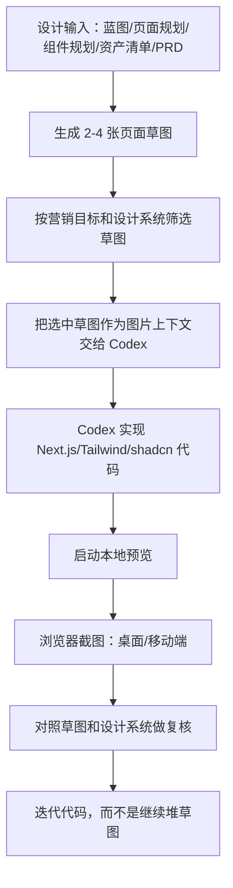

# Codex 草图到代码方法论调研

更新时间：2026-06-11

## 一句话结论

对天机优选官网，最适合的流程不是“先让 AI 一次生成最终页面”，而是“先用 imagegen 生成多张方向草图，再把选中的草图、设计系统、PRD 和真实素材一起交给 Codex 实现代码，最后用浏览器截图反向校验”。草图负责审美探索，代码负责真实交互、响应式、可访问性和素材边界。

## 官方能力依据

| 能力 | 官方资料 | 对本项目的意义 |
|---|---|---|
| Codex CLI 支持图片输入 | https://developers.openai.com/codex/cli/features | 可以把草图或截图作为上下文，让 Codex 读图实现 |
| Codex CLI/App 支持生图 | https://developers.openai.com/codex/cli/features 与 https://developers.openai.com/codex/app/features | 可以在同一工作流中生成 UI 草图、封面、占位视觉方向 |
| Codex App 支持图片输入和截图验证 | https://developers.openai.com/codex/app/features | 可以让 Codex 查看本地页面截图，判断还原度和响应式问题 |
| OpenAI Image API 支持生成和编辑 | https://developers.openai.com/api/docs/guides/image-generation | 大批量或可控生图时可用 API，不一定只靠交互式 imagegen |
| Codex 可结合截图和代码迭代视觉 | https://openai.com/index/codex-for-almost-everything/ | 适合前端设计、mockup、产品概念到代码的循环 |

## 推荐工作流



## 阶段 1：生成草图

目标：探索构图、留白、材质、色调和页面节奏。

输入材料：

- `docs/官网建设蓝图 v0.md`
- `docs/网站结构与页面规划 v0.md`
- `docs/组件与设计系统规划 v0.md`
- `docs/内容资产清单 v0.md`
- `images/Style reference/`

生成建议：

- 每次只生成一个页面或一个关键区块；
- 先做桌面，再做移动端；
- 一次生成 2-4 个方向，不要一张图定生死；
- prompt 里写清楚“不使用可读 Logo 和最终文案”；
- 草图输出统一放到 `images/草图/`。

适合生成的草图：

| 草图 | 用途 |
|---|---|
| 首页首屏 | 定 Hero 构图和留白 |
| 品牌影片模块 | 定视频封面和播放区气质 |
| 申请会员页 | 定申请页的邀请感和低压力路径 |
| 移动端首屏 | 检查标题、CTA、图片如何折叠 |
| Footer + 社媒 | 检查底部社媒 Logo 是否克制 |

不建议生成：

- 带真实 Logo 的最终 UI；
- 带大量中文小字的 UI 截图；
- 复杂会员权益卡；
- 商品货架；
- 软件官网式炫技动效截图。

## 阶段 2：筛选草图

筛选标准来自 PRD，而不是只看“好不好看”。

| 检查项 | 通过标准 |
|---|---|
| 首屏身份感 | 一眼像会员会所，不像商城、SaaS 或企业模板 |
| 留白 | 首屏有呼吸感，不堆卡片 |
| CTA | `申请会员` 有明确位置，不被视觉抢走 |
| 暖色气质 | 暖白、香槟金、胡桃木，不是黑金夜店 |
| 内容节奏 | 每屏只有一个主要任务 |
| 可实现性 | 能被 Tailwind/shadcn 组件合理实现 |
| 素材真实性 | 不依赖不存在的豪华空间或假活动图 |

筛选结果应该写成短评：

```text
选择 homepage-hero-direction-v2.png 作为首屏方向。
理由：留白好，CTA 清楚，视觉像邀请函。
需要调整：减少右侧装饰，移动端图片应下移，按钮不能过金。
```

## 阶段 3：把草图交给 Codex 落代码

推荐输入：

- 选中的草图图片；
- PRD v1；
- 组件与设计系统规划；
- 真实素材路径；
- 明确要求“不要照抄 AI 图中文字”。

Codex CLI 可用图片输入，例如官方文档中的方式：

```bash
codex -i images/草图/homepage-hero-direction.png "根据这张草图和 docs/PRD v1.md，实现首页 Hero 组件"
```

多图可一起输入：

```bash
codex --image images/草图/homepage-hero-direction.png,images/草图/application-page-direction.png "实现首页和申请页的首版结构"
```

在 Codex App 中，可以直接拖拽图片进 prompt composer，或让 Codex 查看本地截图作为上下文。

## 阶段 4：代码实现原则

草图不是代码规范，代码必须服从：

1. `docs/PRD v1.md`
2. `docs/组件与设计系统规划 v0.md`
3. `docs/内容资产清单 v0.md`
4. 真实浏览器截图结果

落代码时必须：

- 使用真实组件名；
- 使用 tokens，不散落 raw hex；
- 主 CTA 指向 `/apply`；
- 视频不作为首屏背景；
- 社媒缺链接时隐藏；
- 不填假地址、假备案、假权益；
- 移动端不横向滚动；
- 动效支持 `prefers-reduced-motion`。

## 阶段 5：截图复核

每次重要视觉实现后都要截图复核。

建议视口：

| 视口 | 用途 |
|---|---|
| 1440x900 | 桌面常规 |
| 1280x800 | 小桌面 |
| 390x844 | iPhone 竖屏 |
| 430x932 | 大屏手机 |

复核问题：

- 第一屏是否仍然有留白；
- CTA 是否清楚；
- 视频模块是否抢首屏；
- 移动端是否拥挤；
- 文字是否溢出；
- Footer 社媒是否过大；
- 实现是否偏离草图中的气质；
- 实现是否为了还原草图牺牲了可访问性。

## 本项目推荐的执行顺序

1. 先用现有草图做首版实现参考，其中 `images/草图/homepage-pc-continuous-space-direction.png` 作为当前推荐的 PC 首页连续空间结构参考；
   - `images/草图/homepage-pc-full-direction.png` 只作为反例参考：它太像普通 landing page，信息过满。
   - `images/草图/homepage-pc-entrance-direction.png`、`images/草图/homepage-pc-live-still-direction.png`、`images/草图/homepage-pc-no-hero-cta-direction.png` 只保留为迭代记录和局部参考。
2. 后续可再补 1-2 张草图：移动端首页首屏、Footer + 社媒；
3. 创建 Next.js 工程；
4. 实现 tokens 和基础组件；
5. 实现 `HomeHero` 和 `BrandFilmSection`；
6. 截图复核；
7. 实现剩余首页区块；
8. 实现 `/apply`；
9. 再截图复核；
10. 根据截图和 PRD 迭代。

## 常见误区

| 误区 | 后果 | 正确做法 |
|---|---|---|
| 把草图当最终设计稿 | 文字、Logo、比例都可能不可用 | 草图只做方向 |
| 让 AI 图生成完整中文 UI | 文字不可控，后续难还原 | 文案由 PRD 和组件实现 |
| 一次生成一张就开工 | 方向容易偏 | 同一页面生成多个方向比较 |
| 代码强行像图 | 响应式和可访问性变差 | 以浏览器实现为准 |
| 用假素材填满页面 | 后续返工大 | 缺素材就留空 |
| 先做酷炫动效 | 重点被抢走 | 先完成结构和静态气质 |

## 对天机优选官网的关键判断

这个流程最有价值的地方不是“让 AI 画漂亮图”，而是让我们在写代码前快速验证三件事：

1. 首页能不能像会员会所，而不是商城；
2. 留白、暖色和申请 CTA 能不能共存；
3. 申请页能不能低压力地承接用户，而不是变成普通注册页。

只要这三件事没跑偏，草图到代码的流程就值得使用。
