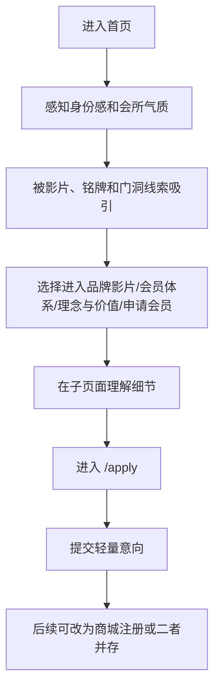

# 天机优选官网 PRD v1

更新时间：2026-06-11

## 1. 产品结论

首版官网要做的是一个面向潜在会员的“线下生活方式会员会所入口”。它不是普通企业展示站，也不是商城首页，更不是标准一页式 landing page。首页负责建立气质、制造兴趣和分流入口；会员体系、供应链、申请流程等解释交给子页面；申请会员页负责承接轻量意向提交，后续再按业务需要改成商城注册或二者并存。

核心目标：

> 让潜在会员感到天机优选能承接他们对品质生活、可信选择、体面关系和身份秩序的隐性需求，并自然进入“申请会员”的下一步。

## 2. 背景

当前已完成的前期材料：

| 文档 | 作用 |
|---|---|
| `docs/官网前期需求对齐.md` | 目标用户、转化目标、风格方向 |
| `docs/官网建设蓝图 v0.md` | 营销理念、隐性需求、消除顾虑、技术方向 |
| `docs/网站结构与页面规划 v0.md` | 页面数量、首页区块、CTA、社媒位置 |
| `docs/组件与设计系统规划 v0.md` | tokens、组件、状态、响应式、动效 |
| `docs/内容资产清单 v0.md` | 已有素材、缺失素材、页面对应关系 |
| `docs/网站设计调研.md` | shadcn/ui 组件策略 |
| `docs/行动教育 Design.md` | 工程规范、状态、可访问性参考 |

## 3. 目标用户

### 第一目标用户

潜在会员。

他们可能关心：

- 是否值得信任；
- 是否符合自己的生活方式和身份感；
- 是否能减少消费和选择试错；
- 是否有真实线下体验、真实服务和长期关系；
- 申请后是否会被强销售；
- 这个会员体系是否适合自己。

### 非第一目标用户

- 只想快速找低价商品的人；
- 想直接浏览商品货架的人；
- 供应商或合作伙伴；
- 内部员工；
- 已注册会员。

这些用户不是首版官网的主要设计对象。

## 4. 产品目标

### P0 目标

| 目标 | 成功标准 |
|---|---|
| 建立会所感和身份感 | 首屏 5 秒内不像商城、不像 SaaS、不像普通企业站 |
| 制造继续了解的兴趣 | 首页不讲完所有细节，而是让用户愿意进入子页面 |
| 建立第一层信任 | 通过留白、视频封面、克制入口降低“普通网站感” |
| 分流用户意图 | 用户可以进入会员体系、理念与价值或申请会员 |
| 轻化申请入口 | `申请会员` 存在但不压倒首页气质 |

### P1 目标

- 更完整解释会员体系；
- 补充理念与价值页；
- 补充关于我们基础信息；
- 接入真实社媒链接；
- 优化视频封面与压缩版本。

### P2 目标

- 活动/私董会页面；
- 内容/洞察页面；
- 会员故事；
- 更多真实线下素材；
- 更完整的商城/会员系统联动。

## 5. 核心转化路径



当前推荐：

- CTA 文案：`申请会员`
- CTA 目标：`/apply`
- 首页首屏不把 `申请会员` 做成最大视觉焦点，保留为 Header 轻入口或首页入口之一
- `/apply` 首版先承接轻量意向提交
- 后续可改为跳商城注册，或保留“意向提交 + 商城注册”两种入口
- 不从首页直接裸跳商城注册

## 6. 范围

### 首版必须做

| 范围 | 说明 |
|---|---|
| 首页 `/` | 建立气质、展示品牌影片、分流到子页面 |
| 申请会员页 `/apply` | 承接转化，说明申请方式，提交轻量意向 |
| 响应式 Header | 桌面导航、移动端 Sheet、主 CTA |
| Footer + 社媒入口 | 社媒 Logo 外链，缺链接隐藏 |
| 品牌影片模块 | 使用现有视频，不做首屏背景 |
| 组件与 tokens | 按 `组件与设计系统规划 v0` 实现 |
| 空内容策略 | 不用 mock 数据掩盖缺口 |

### 首版建议做

| 范围 | 说明 |
|---|---|
| `/membership` | 可先做简单页，或首页区块锚点 |
| `/philosophy` | 可先做简单页，承接品牌理念 |
| `/film` | 可先做简单页，独立承接品牌影片和影片说明 |
| `/about` | 信息不足时保留基础结构和待补字段 |
| 视频封面 | 使用 `images/Style reference/视频封面.png` |

### 首版不做

- 完整会员系统；
- 登录注册系统；
- 支付；
- 商品列表；
- 后台管理；
- 活动内容库；
- 复杂 CMS；
- 大面积 WebGL/粒子动效；
- 无真实素材的活动墙；
- 编造权益、地址、联系方式、备案、合作方。

## 7. 页面需求

## 7.1 首页 `/`

### 目的

首页不再独立完成全部解释和转化，而是完成“建立气质、制造兴趣、分流入口”三个任务。它应该像门厅或邀请函，而不是说明书。

### 区块结构

| 顺序 | 区块 | 组件 | 目标 |
|---:|---|---|---|
| 1 | Header | `SiteHeader` | 品牌识别、导航、申请入口 |
| 2 | Hero | `HomeHero` | 建立身份感，不强推动作 |
| 3 | Brand Film | `BrandFilmSection` | 展示真实视频，建立情绪和第一层信任 |
| 4 | Three Entrances | `HomeEntrances` | 分流到会员体系、理念与价值、申请会员 |
| 5 | Quiet Closing | `QuietClosing` | 用一句理念收束首页 |
| 6 | Footer | `SiteFooter` + `SocialLinks` | 常规信息、社媒、兜底入口 |

### Hero 要求

必须：

- 大量留白；
- 暖色、克制、会所感；
- 首屏不强推申请，`申请会员` 可以保留在 Header 右上角轻入口；
- Hero 不放功能按钮，只保留极轻的向下滚动提示；
- 不使用商品、价格、优惠券；
- 不自动播放背景视频。

缺失素材处理：

- Logo 缺失时使用文字品牌名；
- 主视觉缺失时保留留白布局，不使用假图。

### Brand Film 要求

视频源：

`Video/天机优选 - 01.mp4`

必须：

- 第二屏独立模块；
- 静态封面 + 播放按钮；
- 点击后播放；
- 不自动播放声音；
- 移动端避免预加载完整大视频。

已指定：

- 视频封面图：`images/Style reference/视频封面.png`

待补：

- Web 压缩版；
- 视频标题/简介。

### SupplyChainProof 要求

必须把供应链讲成用户价值：

- 稳定来源；
- 精选机制；
- 减少试错；
- 线下体验承接；
- 长期服务。

禁止：

- “全网最低”；
- “直供超值”；
- 无来源数字；
- 冷冰冰系统介绍。

首页策略调整后，`SupplyChainProof` 不作为首页必选模块，优先放到 `/philosophy` 或 `/membership`。

### Three Entrances 要求

首页必须提供三个克制入口：

| 入口 | 指向 | 目标 |
|---|---|---|
| 会员体系 | `/membership` | 解释会员价值、路径和适配人群 |
| 理念与价值 | `/philosophy` | 解释品牌理念、供应链与生活方式关系 |
| 申请会员 | `/apply` | 承接轻量意向 |

规则：

- 三个入口视觉权重接近；
- 不做厚重卡片墙；
- 每个入口只写一句短说明；
- `申请会员` 不应压倒其他入口。

### SocialLinks 要求

社媒入口放在 Footer 底部，用 Logo 外链即可。

必须：

- 缺链接的平台不展示；
- 外链新窗口打开；
- `rel="noopener noreferrer"`；
- 每个图标有 `aria-label`；
- 不做成首页大模块。

## 7.2 申请会员页 `/apply`

### 目的

申请会员页不是复杂注册页，而是低压力转化承接页。

### 页面结构

| 顺序 | 模块 | 组件 | 目标 |
|---:|---|---|---|
| 1 | Apply Hero | `ApplyMemberCTA` 或自定义 hero | 确认用户来到申请页面 |
| 2 | 适合谁 | `SectionShell` + 文案 | 帮用户自我筛选 |
| 3 | 申请后会发生什么 | `ApplyFlow` | 降低未知感 |
| 4 | 申请方式 | 轻量意向表单或待接状态 | 承接首版申请意向 |
| 5 | 顾虑说明 | 可用 FAQ 简化 | 回答是否购买、是否推销、是否审核 |
| 6 | Final CTA | `ApplyMemberCTA` | 最后行动入口 |

### 文案方向

标题方向：

> 申请成为天机优选会员

辅助说明方向：

> 申请不是一次仓促决定，而是一次了解彼此是否适合的开始。

### 首版入口策略

首版采用轻量意向表单：

- 字段应尽量少；
- 必须补隐私说明；
- 必须确认信息处理方式；
- 提交成功后只说明“已收到申请意向”，不承诺未确认的审核结果或服务时效。

如果意向表单字段和隐私说明暂未确认：

- 显示待接入口状态；
- 不收集用户个人信息；
- 不展示假表单。

后续如果商城注册入口稳定，可以把 `/apply` 的提交动作替换为跳商城，或保留“轻量意向 + 商城注册”两种入口。

## 7.3 会员体系页 `/membership`

首版可以做成独立页，也可以先作为首页区块。

如果做独立页，结构：

- 会员体系定义；
- 会员价值；
- 会员路径；
- 线下体验；
- 供应链如何服务会员；
- 申请 CTA。

禁止：

- 编造会员权益；
- 过多等级卡；
- 黑金 VIP 卡视觉；
- 夸张身份话术。

## 7.4 理念与价值页 `/philosophy`

首版可以做成独立页，也可以先作为首页区块。

内容方向：

- 为什么做会员制；
- 为什么品质选择需要稳定系统；
- 供应链、线下体验和可信关系如何连接；
- 我们不想成为怎样的平台；
- 申请 CTA。

语气：

- 克制；
- 真实；
- 像邀请，不像宣言。

## 7.5 关于我们 `/about`

只放可验证信息。

模块：

- 品牌简介；
- 公司基础信息；
- 地址；
- 联系方式；
- 备案；
- 社媒入口；
- 申请 CTA。

缺什么不展示什么，不编造。

## 7.6 品牌影片页 `/film`

首版可以做成独立页，也可以先作为首页影片区的扩展页。

目的：

- 给品牌影片一个安静、完整的观看场域；
- 避免首页首屏出现“观看影片”按钮带来的廉价感；
- 承接用户对品牌真实感、线下空间和会员气质的进一步判断。

页面结构：

- 影片标题；
- 视频封面和播放区；
- 一段不超过 120 字的影片说明；
- 影片下方连接会员体系、理念与价值、申请会员；
- Footer。

规则：

- 不自动播放声音；
- 不把影片页做成活动宣传页；
- 没有正式文案前，只保留标题、影片和待补说明位置；
- 不编造拍摄地点、人物、活动信息。

## 8. 组件需求

PRD 直接引用 `docs/组件与设计系统规划 v0.md`。

### P0 组件

| 组件 | 说明 |
|---|---|
| `Button` | shadcn 基础按钮，定义项目 variants |
| `SiteHeader` | Header、导航、移动端菜单、CTA |
| `HomeHero` | 首屏 |
| `BrandFilmSection` | 视频封面和播放 |
| `HomeEntrances` | 首页三个分流入口 |
| `QuietClosing` | 首页理念收束 |
| `ApplyMemberCTA` | 统一 CTA |
| `SocialLinks` | Footer 社媒外链 |
| `SiteFooter` | 页脚 |

### P1 组件

| 组件 | 说明 |
|---|---|
| `MembershipIntro` | 定义天机优选，优先子页面 |
| `SupplyChainProof` | 供应链信任证据，优先子页面 |
| `MembershipJourney` | 申请路径，优先申请页 |
| `LifestyleScenes` | 生活方式场景 |
| `PhilosophySection` | 理念区块 |
| `ApplyFlow` | 申请流程 |
| `ApplyFormPlaceholder` | 申请入口待补 |
| `SectionShell` | 区块壳 |
| `SectionHeading` | 标题规范 |

## 9. 内容与资产需求

引用：`docs/内容资产清单 v0.md`

### 已有可用

- `Video/天机优选 - 01.mp4`
- `images/Style reference/`
- `images/草图/homepage-hero-direction.png`
- `images/草图/homepage-pc-full-direction.png`
- `images/草图/membership-system-direction.png`
- `images/草图/application-page-direction.png`

### P0 待补

| 内容/资产 | 影响 |
|---|---|
| 正式品牌中文名 | Header、SEO、Footer |
| Logo | 品牌识别、favicon |
| 申请会员真实入口 | `/apply` 轻量意向 |
| 申请流程 | Journey、申请页 |
| 视频封面图 | Brand Film，已指定 |
| 社媒链接 | Footer |
| 联系方式 | Footer/About |
| 地址/备案 | About/Footer |

### 缺失处理

- 缺 Logo：使用文字品牌名；
- 缺社媒链接：隐藏对应 Logo；
- 轻量意向字段未确认：显示待接状态，不收集信息；
- 缺线下图片：不展示假活动墙；
- 缺供应链证据：不写假数字。

## 10. 技术方案

推荐技术栈：

`Next.js + TypeScript + Tailwind CSS + shadcn/ui + Framer Motion`

### shadcn/ui 首批组件

```bash
npx shadcn@latest add button sheet dialog aspect-ratio separator badge tooltip
```

如首版做意向表单，再补：

```bash
npx shadcn@latest add input textarea form
```

### 建议目录

引用 `docs/组件与设计系统规划 v0.md` 的目录建议：

```text
src/
  app/
    page.tsx
    apply/page.tsx
    membership/page.tsx
    philosophy/page.tsx
    about/page.tsx
  components/
    ui/
    layout/
    sections/
    conversion/
    shared/
  lib/
    site-config.ts
    content-placeholders.ts
```

### 工程规则

- 文案和链接尽量集中在 `site-config.ts` 或内容配置中；
- 不在组件里散落待补字段；
- 图片和视频进入工程前整理到 `public/`；
- 原始素材不覆盖；
- 所有页面响应式优先；
- 动效必须支持 `prefers-reduced-motion`。

## 11. SEO 与元信息

首版需要：

- 首页 title；
- 首页 description；
- `/apply` title/description；
- favicon，Logo 缺失时待补；
- Open Graph 图，首版可待补；
- 基础语义结构：`header`、`main`、`section`、`footer`；
- 图片 alt 文案。

暂不做：

- 内容站 sitemap 复杂配置；
- 多语言；
- 博客 SEO；
- 结构化商品数据。

## 12. 可访问性要求

必须满足：

- Header 可键盘导航；
- 移动端 Sheet 可 ESC 关闭并回收焦点；
- 视频 Dialog 可 ESC 关闭；
- CTA focus-visible 明确；
- 社媒外链有 `aria-label`；
- 图片有合适 alt；
- 错误态不只用颜色表达；
- 文本对比度达到 WCAG 2.2 AA；
- 动效尊重 `prefers-reduced-motion`。

## 13. 性能要求

必须：

- 首屏不加载完整 154MB 视频；
- 视频点击后播放；
- 图片设置稳定尺寸或 aspect ratio；
- 移动端无横向滚动；
- Lighthouse 目标：Performance 80+、Accessibility 90+、SEO 90+。

建议：

- 生成视频封面；
- 生成压缩视频；
- 图片转换为 web 友好格式；
- 非首屏图片 lazy load。

## 14. 埋点与分析

首版可以先预留，不强制接入。

建议未来跟踪：

- Hero CTA 点击；
- Brand Film 播放；
- Membership Journey CTA 点击；
- Final CTA 点击；
- `/apply` 到商城注册入口点击；
- 社媒外链点击。

注意：上线前如接入分析工具，需要确认隐私和合规策略。

## 15. 验收标准

### 营销验收

- 首屏 5 秒内能看出这是会员会所；
- 用户能理解下一步是申请会员；
- 页面不是普通商城、SaaS 或企业模板站；
- 供应链作为信任证据，而不是首屏主卖点；
- 页面主动降低“怕被销售、怕不匹配、怕不真实、怕麻烦”的顾虑；
- CTA 让用户觉得可以先往前走一步，而不是被逼注册。

### 视觉验收

- 暖色、留白、材质感明确；
- 不出现黑金夜店风；
- 不出现蓝紫科技 SaaS 风；
- 不出现商品货架；
- 动效克制，不抢主文案和 CTA；
- 移动端无拥挤、遮挡和横向滚动。

### 功能验收

- `/` 可访问；
- `/apply` 可访问；
- Header 导航可用；
- 移动端菜单可用；
- 视频模块可播放或有错误态；
- CTA 跳转正确；
- 社媒链接缺失时不显示假入口；
- Footer 缺失字段不编造。

### 技术验收

- 本地 dev server 可运行；
- build 通过；
- 无明显控制台错误；
- TypeScript 无关键错误；
- Lighthouse 达到目标；
- `prefers-reduced-motion` 下动效可降级。

## 16. 风险与待确认

| 风险 | 影响 | 处理 |
|---|---|---|
| 轻量意向字段/隐私说明未确认 | `/apply` 无法收集信息 | 字段确认前显示待接状态 |
| Logo 缺失 | 品牌识别弱 | 先用文字品牌名 |
| 线下素材缺失 | 会所感不足 | 不做假活动墙，先靠留白/视频/文案 |
| 视频过大 | 性能差 | 截封面、压缩、点击播放 |
| 会员权益未确认 | 容易误导 | 不编造权益 |
| 社媒链接未确认 | Footer 空 | 缺链接隐藏 |
| 联系方式/备案未确认 | 官网完整性不足 | 待补，不编造 |

## 17. 开发任务拆分建议

### Milestone 1：工程骨架

- 创建 Next.js + TypeScript 项目；
- 接入 Tailwind；
- 初始化 shadcn/ui；
- 定义 tokens；
- 建立目录结构；
- 创建 `site-config.ts`。

### Milestone 2：首页基础

- `SiteHeader`;
- `HomeHero`;
- `BrandFilmSection`;
- `HomeEntrances`;
- `QuietClosing`;
- `ApplyMemberCTA`;
- `SiteFooter`;
- `SocialLinks`。

### Milestone 3：申请页

- `/apply`;
- `ApplyFlow`;
- `ApplyFormPlaceholder`;
- 顾虑说明；
- 待接入口状态。

### Milestone 4：响应式与验证

- 桌面/平板/手机检查；
- 视频播放检查；
- Keyboard/focus 检查；
- Lighthouse；
- build。

### Milestone 5：内容补齐

- Logo；
- 视频封面使用 `images/Style reference/视频封面.png`；
- 社媒链接；
- 联系方式；
- 轻量意向字段与隐私说明；
- 真实线下/供应链素材。

## 18. 下一步

PRD 完成后，建议下一步是：

1. 产出 `技术选型与工程方案 v0.md`，确认工程目录、依赖和初始化命令；
2. 从视频中截取封面图；
3. 创建 Next.js 工程骨架；
4. 先做首页和 `/apply` 的低保真真实代码版本；
5. 用浏览器截图验证桌面和移动端，再迭代视觉。
