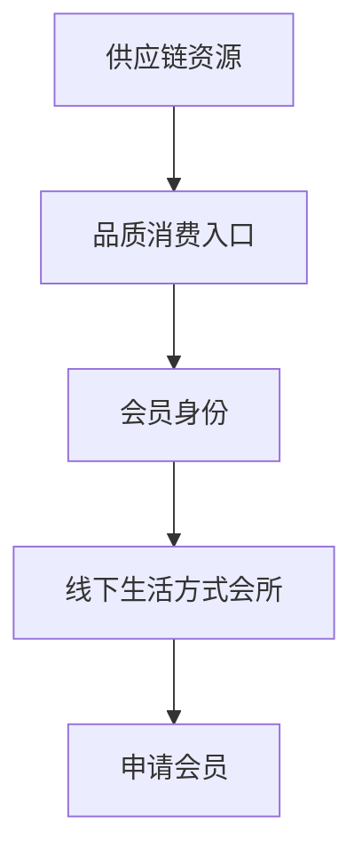
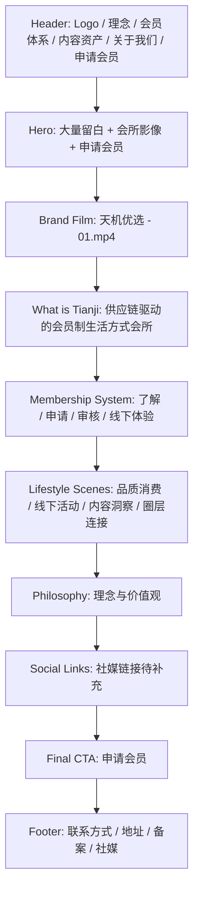
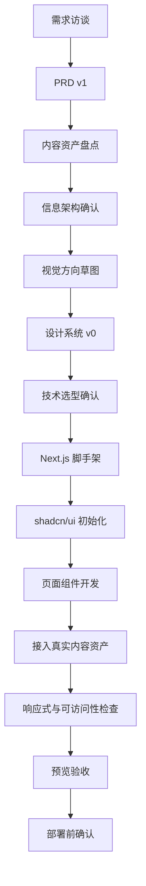

# 官网前期需求对齐 v0

更新时间：2026-06-11

## 一句话判断

这个官网的核心不是“展示公司信息”，而是让潜在会员理解：天机优选是一个以供应链资源为基础的线下生活方式会员会所，并引导他们申请会员。

## 当前成熟度判断

你的想法是成熟的，成熟在三点：

- 先对齐需求和设计，再选框架，再开发代码。
- 明确第一目标用户是潜在会员。
- 明确第一转化动作是申请会员，会员注册登记暂时放在商城侧。

还不够成熟的地方主要有三点：

- “供应链驱动”和“线下生活方式会所”的关系需要讲清楚，否则用户会误解成普通电商、商超会员或高端社群。
- “会员私董会风格”需要有反例约束，否则容易做成黑金夜店风、PPT 金色手册风或假高端金融风。
- 内容资产还没完整盘点，后续开发必须保留真实缺口，不要用 mock 数据填满页面。

## 已确认需求

| 维度 | 已确认 |
|---|---|
| 第一目标用户 | 潜在会员 |
| 首页第一目标 | 引导用户申请会员 |
| 官网定位 | 线下生活方式会员会所 |
| 业务底层 | 供应链驱动的线下会员商城 |
| 会员系统边界 | 官网先解释会员体系；注册登记在商城侧完成 |
| 风格关键词 | 高净值、克制、俱乐部、信任、身份感、大量留白 |
| 参考风格 | `images/Style reference/` 下的暖色视觉素材 |
| 已有视频 | `Video/天机优选 - 01.mp4`，约 99 秒，2048x1024，H.264 + AAC |
| 草图输出 | `images/草图/` |

## 清晰的问题定义

> 为潜在会员设计一个高信任、克制、暖色、线下会所感的公司官网，解释天机优选的会员体系与价值观，展示品牌视频和必要信息，并把用户引导到“申请会员”。

## 产品叙事

推荐主叙事：

> 天机优选不是一个普通商城，而是一个以供应链资源为基础的线下生活方式会员会所。用户通过会员身份获得品质消费、线下体验、认知内容和可信圈层连接。

这个叙事里有三层：

不要在首页首屏一开始解释太多“供应链系统”。首屏先建立身份感和会所感；第二屏以后再解释供应链如何让会员获得更好的产品、活动和连接。

## 视觉 thesis

> 暖色、留白、邀请函式的线下会所官网：像一张克制的会员邀请，而不是一张销售海报。

### 视觉关键词

| 要保留 | 要避免 |
|---|---|
| 暖白、米金、胡桃木、香槟金 | 大面积纯黑金 |
| 真实会所空间、阳光、材质 | 抽象科技光效 |
| 大量留白、低密度文案 | 满屏卡片、密集图标 |
| 邀请感、顾问感、私密感 | 大促销、电商货架 |
| 高净值但克制 | 暴发户式奢华 |

## 反例库

这些反例后续设计和开发时必须主动避开。

| 反例 | 表现 | 为什么不适合 |
|---|---|---|
| 黑金夜店风 | 黑底、金字、强光效、钻石/皇冠堆满 | 会显得廉价和娱乐场所化，削弱信任 |
| PPT 金色手册风 | 五六个等级卡片、满屏图标、金色波纹背景 | 适合内部手册，不适合官网首屏，会让页面像招商课件 |
| 普通电商首页 | 商品瀑布流、价格、优惠券、爆款推荐 | 会把天机优选降级成卖货平台 |
| 企业蓝白模板站 | 大 banner、公司简介、新闻列表、资质墙 | 信任有了，但缺少会员会所的身份感 |
| SaaS 卡片模板 | Hero + 一堆圆角功能卡 + 图标墙 | 看起来像软件产品，不像线下生活方式会所 |
| 假高端金融风 | 西装人物、豪宅、夸张成功学标语 | 容易制造距离感和不真实感 |

## 首页信息架构 v0

## 页面清单 v0

| 页面 | 目的 | 状态 |
|---|---|---|
| 首页 | 建立信任与身份感，引导申请会员 | 必做 |
| 会员体系页 | 解释会员路径、权益范围、线下体验 | 必做 |
| 品牌影片页或首页影片区 | 展示现有宣传视频 | 必做 |
| 理念与价值页 | 解释供应链、品质消费、圈层连接 | 必做 |
| 关于我们 | 公司基础信息、地址、联系渠道 | 必做 |
| 申请会员页 | 承接 CTA，跳转商城注册或提交轻量意向 | 必做 |
| 内容/社媒入口 | 承接外部平台链接 | 待资产补充 |
| 活动/私董会页 | 展示线下活动与会员氛围 | 二期，缺素材时先留入口 |

## 组件与技术边界

推荐沿用 `docs/网站设计调研.md` 的组件策略：

- 基础组件优先使用 shadcn/ui：`Button`、`Card`、`Navigation Menu`、`Sheet`、`Breadcrumb`、`Aspect Ratio`、`Dialog`、`Field`、`Input`。
- 业务组件自己封装：`SiteHeader`、`HomeHero`、`BrandFilmSection`、`MembershipJourney`、`ApplyMemberCTA`、`SiteFooter`。
- 不要在官网内实现完整会员系统；官网只解释会员体系和承接申请动作。

### 技术建议

| 选项 | 推荐度 | 原因 |
|---|---:|---|
| Next.js + Tailwind + shadcn/ui | 高 | 官网、后续会员入口、SEO、组件生态都更稳 |
| Astro + Tailwind | 中 | 静态官网非常轻，但后续交互和会员入口扩展不如 Next.js 顺 |
| Vite React SPA | 中低 | 开发快，但官网 SEO 和内容页不如 Next.js/Astro |

当前推荐：`Next.js + Tailwind + shadcn/ui`。  
原因：你现在虽然先做官网，但未来可能接商城会员申请、内容页、视频、社媒和活动页，Next.js 的扩展空间更合适。

## 开发流程图

## 资产盘点

### 已有资产

| 资产 | 路径 | 用途 |
|---|---|---|
| 宣传视频 | `Video/天机优选 - 01.mp4` | 首页品牌影片区 |
| 暖色视觉参考 | `images/Style reference/` | 视觉方向、色调、会所感参考 |
| 首页首屏草图 | `images/草图/homepage-hero-direction.png` | 首屏方向参考 |
| 会员体系草图 | `images/草图/membership-system-direction.png` | 会员解释页方向参考 |
| 申请会员草图 | `images/草图/application-page-direction.png` | 申请转化页方向参考 |

### 待补资产

| 缺口 | 影响 | 占位策略 |
|---|---|---|
| Logo 源文件 | 影响 Header、Footer、邀请视觉 | 留空，不 mock |
| 真实线下空间照片 | 影响会所感和信任 | 留空，不用图库假图替代最终版 |
| 会员权益准确文案 | 影响会员体系页 | 先写结构，不写假权益 |
| 申请会员真实入口 | 影响 CTA 跳转 | 先标记为待接商城 |
| 社媒链接 | 影响 footer 和社媒区 | 显示“待补充” |
| 联系方式 / 地址 / 备案 | 影响官网完整性 | 留空，不编造 |
| 活动照片/视频 | 影响私董会氛围 | 没有素材就不展示活动墙 |

## 草图说明

| 草图 | 评价 | 后续建议 |
|---|---|---|
| `homepage-hero-direction.png` | 最接近“留白、会所、邀请感” | 可作为首屏主方向 |
| `membership-system-direction.png` | 适合解释会员路径 | 后续减少小字，改为真实流程文案 |
| `application-page-direction.png` | 申请页气质很好 | 表单只做轻量意向，真实注册跳商城 |

注意：草图是视觉和布局参考，不作为最终 UI 文字稿。AI 图里的文字和 Logo 不能直接用。

## 下一轮必须确认的问题

1. 天机优选的会员申请是“立即跳商城注册”，还是“先提交意向，由顾问联系”？
2. 会员资格是否需要审核？如果需要，审核逻辑是否要在官网说出来？
3. 首页是否要突出“供应链”这个词，还是把它放在第二屏解释？
4. 品牌影片是首屏背景氛围，还是第二屏独立播放模块？
5. 是否已有正式 Logo、品牌中文名、英文名和 slogan？
6. 线下生活方式会所是否有真实空间、活动、产品、人物素材？
7. 申请会员按钮文案最终是“申请会员”“预约了解”“加入会员”还是其他？

## 本阶段验收标准

- 需求目标清楚：潜在会员，申请会员。
- 视觉方向清楚：暖色、克制、线下会所、大量留白。
- 反例清楚：不做黑金夜店、电商货架、PPT 金色手册、SaaS 卡片模板。
- 技术方向清楚：优先 Next.js + Tailwind + shadcn/ui。
- 内容缺口清楚：不使用 mock 数据掩盖素材不足。

## 后续练习点

你后续可以重点练习三种能力：

1. 把“感觉”翻译成设计约束  
   例如“高净值”不是多放金色，而是克制、材质、留白、真实空间、低密度信息。

2. 把“业务复杂性”翻译成用户路径  
   例如供应链、会员商城、线下会所、私董会这些词不能同时砸给用户，要按理解顺序展开。

3. 把“想展示的内容”翻译成转化动作  
   官网不是资料仓库。每一屏都要服务“用户为什么信任我们，并愿意申请会员”。
