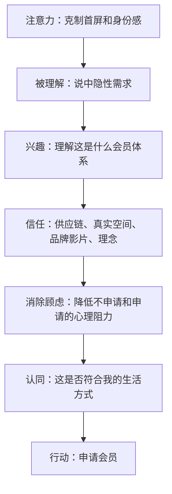
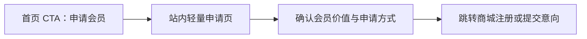
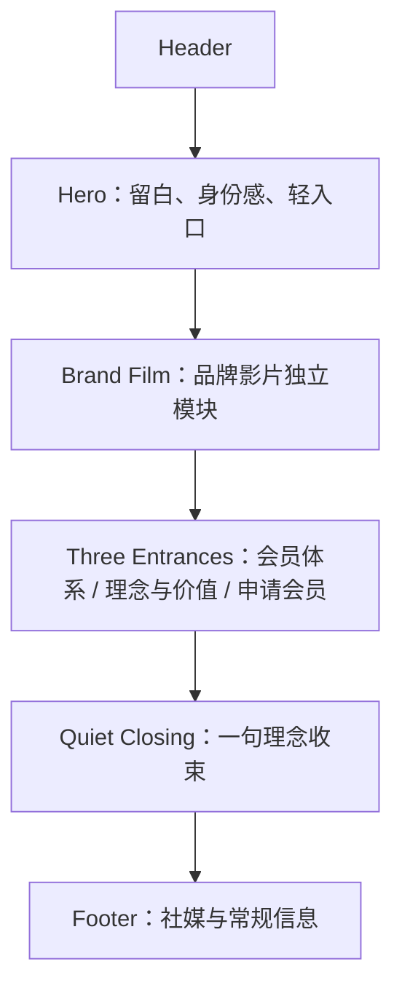
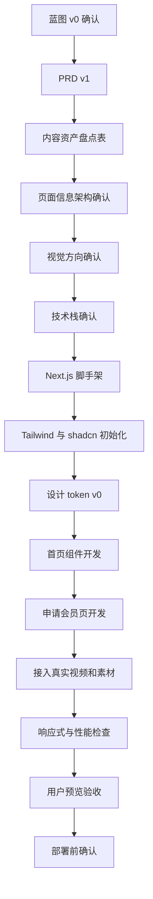

# 官网建设蓝图 v0

更新时间：2026-06-11

## 一句话结论

天机优选官网首版应该被设计成一个“会员会所门厅”，不是普通公司展示站，也不是商城首页。首页的任务不是一次讲完所有信息，而是让潜在会员先感到被邀请、产生兴趣，并选择进入会员体系、理念与价值或申请会员等子页面继续了解。

更高一层的理解是：官网不是直接售卖会员资格，而是让潜在会员感受到天机优选能承接他们对品质生活、可信选择、体面关系和身份秩序的隐性需求。申请会员应该成为这种认同之后的自然结果，而不是首页强推出来的动作。

## 当前阶段判断

现在可以进入框架确定阶段，但这里的“框架”不只指技术框架，而是四个框架一起定：

| 框架 | 本阶段要定什么 | 为什么重要 |
|---|---|---|
| 营销框架 | 用户为什么愿意申请会员 | 决定首页文案、CTA 和页面顺序 |
| 信息架构 | 首页和核心页面怎么组织 | 防止后续页面越做越散 |
| 视觉框架 | 什么是高级、什么是假高级 | 防止做成电商、SaaS 或黑金夜店风 |
| 技术框架 | 用什么工程栈开发 | 决定开发效率、SEO、动效和后续扩展 |

首版目标不是一次做完整会员系统，而是做出一个可信、克制、有申请转化能力的官网原型。

## 项目定位

### 官网定位

天机优选是一个以供应链资源为基础的线下生活方式会员会所。

### 品牌叙事升级

官网的核心不只是“我们有什么”，而是“我们理解你真正想要什么，也理解你不想被怎样对待”。

潜在会员内心可能有一些不可明说但足够真实的需求：

- 想要更好的生活品质，但不想显得炫耀；
- 想要更可信的消费选择，但不想被销售话术围攻；
- 想要同频关系和优质连接，但不想显得功利；
- 想减少试错成本，但不想把生活变成精明算计；
- 想拥有身份感，但不想落入粗糙的黑金奢华。

因此，网站不应该直接喊出“高端圈层”“人脉资源”“身份跃迁”这类过于赤裸的词。它应该用更克制的方式表达：天机优选把品质消费、线下体验、稳定供应链和可信关系放在一个会员系统里，让用户自然感到“这里可能适合我”。

推荐理念表达：

> 让品质选择、线下体验与可信关系，回到一个更有秩序的会员系统里。

### 第一目标用户

潜在会员。

他们进入官网时，最可能关心的不是“你们的供应链有多复杂”，而是：

- 这是不是一个值得信任的会员体系；
- 我加入之后能获得什么样的生活方式和资源连接；
- 这个品牌是否有真实审美、真实能力和真实线下场景；
- 申请会员是否体面、清晰、低压力。

### 第一转化动作

申请会员。

推荐按钮文案：`申请会员`。

不建议首屏使用 `立即注册`、`马上加入`、`免费注册` 这类强销售、强工具化文案。它们会削弱会所感和身份感。

## 营销路径

推荐首页使用这条心理路径：

### 关键判断

不要试图取消用户思考，而是要减少无效思考。

对高净值、会所、会员制产品来说，用户需要一点思考空间来确认身份认同。如果直接把用户扔到商城注册页，可能短期路径更短，但长期会损失信任感和高级感。

这里的转化逻辑不是“让用户来不及后悔”，而是“让用户觉得自己被准确理解”。当用户感到品牌说中了他想要但不方便直接说出口的需求，申请会员就不再像被推销，而更像一次自我选择。

从 Jason Fladlien 的文案理念看，这里还要补一层：用户不是因为足够心动才行动，而是因为“没有足够强的不行动理由”才行动。官网不能只堆美好承诺，还要主动说出并化解潜在会员的顾虑。

更适合的路径是：

### 申请路径建议

首版建议采用“站内轻量申请页 + 商城注册承接”的方式。

| 方案 | 推荐度 | 判断 |
|---|---:|---|
| 首页按钮直接跳商城注册 | 中低 | 路径短，但容易把会员身份降级成普通账户注册 |
| 首页按钮进入站内申请页，再跳商城 | 高 | 保留身份感，也能解释会员价值和后续动作 |
| 首页按钮提交意向，由顾问联系 | 中高 | 更像会所邀请，但需要后续人工承接能力 |

当前推荐：

> 首页按钮进入站内“申请会员”页。申请页先解释会员价值、申请方式和后续流程，再提供商城注册入口或意向提交入口。

### 消除约束的转化逻辑

这套官网不应该只问“我们能给会员什么好处”，还要问“潜在会员为什么会犹豫”。

需要被看见和化解的顾虑：

| 潜在顾虑 | 用户内心话 | 官网应该如何回应 |
|---|---|---|
| 怕被销售 | 点了申请之后，会不会被反复推销 | 申请路径要克制，说明后续流程，不制造压迫感 |
| 怕不匹配 | 这个会员体系是不是适合我 | 用会员画像、生活方式和价值观帮助用户自我判断 |
| 怕不真实 | 这是不是包装出来的高端感 | 用真实视频、线下空间、供应链逻辑和克制文案建立信任 |
| 怕太功利 | 加入是不是显得我在追逐圈层 | 避免高端人脉、身份跃迁等直白词，改用同频、秩序、可信关系 |
| 怕麻烦 | 申请会不会很复杂 | 用轻量申请页解释流程，字段少，动作清楚 |
| 怕普通 | 这是不是又一个商城会员 | 首屏和第二屏必须先建立会所感，再解释商城和供应链 |
| 怕做错决定 | 我现在申请会不会太仓促 | 允许用户先了解、观看影片、预约沟通，而不是只给一个硬注册按钮 |

因此，页面设计要同时完成三件事：

1. 让用户看见向往的生活方式。
2. 让用户看见维持现状的隐性成本：继续依赖随机推荐、低效试错、零散消费和不稳定选择。
3. 让用户看见申请会员的风险被降低：路径清楚、语气克制、可以先了解、不会被粗暴推销。

### 多钥匙策略

不要假设所有潜在会员会被同一个理由打动。首页应该给出多种“钥匙”，让不同类型的人都能找到自己的进入理由。

| 用户类型 | 更容易被什么打动 | 页面承接 |
|---|---|---|
| 向往未来型 | 更好的生活方式、更稳定的品质选择 | Hero、Lifestyle Scenes |
| 逃离混乱型 | 减少试错、减少被销售、减少选择疲劳 | SupplyChainProof、MembershipIntro |
| 风险厌恶型 | 申请路径清楚、可信、低压力 | ApplyMemberCTA、申请会员页 |
| 身份认同型 | 同频、体面、克制、有筛选感 | Hero、Philosophy、视觉留白 |
| 证据驱动型 | 真实视频、真实空间、真实供应链能力 | BrandFilm、Why Trust |

### 激进坦诚原则

官网可以适度主动说出反对意见，这比假装用户没有顾虑更可信。

可以表达：

- 会员制不适合所有人；
- 申请不是立即购买，而是一次了解和确认；
- 我们更重视长期信任，而不是一次性转化；
- 如果你只是想找低价商品，商城可能不是理解天机优选的最佳入口；
- 供应链不是口号，它最终要体现在稳定品质、线下体验和长期服务中。

避免表达：

- 过度稀缺恐吓；
- 贬低非会员；
- 制造阶层焦虑；
- 用“错过就没有”逼迫行动；
- 用假坦诚包装销售话术。

## 首页信息架构

首页应围绕“气质建立和分流入口”组织，而不是围绕“完整解释”或“强申请转化”组织。

### 首屏建议

首屏只做一件事：让潜在会员感到“这是一个值得进一步了解的会员会所”。

首屏建议包含：

- Logo；
- 极简导航；
- 一句主标题；
- 一句辅助说明；
- 一个极轻的向下提示，不放功能按钮；
- `申请会员` 可保留在 Header 或 Three Entrances 中，但不要成为首屏最大视觉焦点；
- 大量留白；
- 暖色、真实材质、会所感视觉。

首屏不建议包含：

- 大段供应链解释；
- 自动播放品牌影片背景；
- 多个权益卡片；
- 会员旅程流程；
- 生活方式图墙；
- 商品、价格、优惠券；
- 复杂滚动动效；
- 密集图标墙。

### 品牌影片位置

品牌影片不建议作为首屏背景。

推荐放在第二屏独立模块，使用静态封面 + 播放按钮。这样既保留影片的情绪价值，也不会抢走首屏的注意力。

视频来源：

`Video/天机优选 - 01.mp4`

### 供应链表达位置

供应链不做首屏主角，应放在第二屏以后作为信任证据。

推荐表达方式：

> 供应链不是对用户炫耀的系统能力，而是会员获得稳定品质、精选商品和线下体验的基础。

不要把“供应链驱动”写成冷冰冰的技术介绍。它应该服务于会员价值，而不是替代会员价值。

## 页面清单 v0

| 页面 / 模块 | 首版是否需要 | 目的 |
|---|---|---|
| 首页 | 必做 | 建立身份感和信任，引导申请会员 |
| 申请会员页 | 必做 | 承接 CTA，解释申请流程，连接商城或意向提交 |
| 会员体系页 / 区块 | 必做 | 解释会员路径、权益范围、线下体验 |
| 品牌影片区块 | 必做 | 展示品牌情绪、理念和质感 |
| 理念与价值页 / 区块 | 必做 | 解释供应链、品质消费、圈层连接的关系 |
| 关于我们 | 必做 | 展示公司基础信息、地址、联系方式 |
| 社媒与内容入口 | 必做但可留空 | 承接小红书、视频号、公众号等外部入口 |
| 活动 / 私董会页 | 二期 | 需要真实活动素材后再做 |
| 商品展示页 | 暂不做 | 避免官网变成普通商城 |

## 视觉框架

### 视觉 thesis

像一张克制的会员邀请函，而不是一张销售海报。

### 关键词

| 应该保留 | 应该避免 |
|---|---|
| 暖白、香槟金、胡桃木、柔和光线 | 纯黑金、强霓虹、蓝紫科技渐变 |
| 大量留白、低密度信息 | 满屏卡片、密集卖点、图标堆叠 |
| 会所、餐叙、城市生活、真实材质 | 虚假豪宅、成功学人物、抽象光效 |
| 邀请感、顾问感、私密感 | 大促感、招商感、课程销售感 |
| 克制动效、慢节奏 | 炫技滚动、粒子、3D 旋转、过度 WebGL |

### 参考素材

已有暖色视觉参考：

`images/Style reference/`

已有草图：

- `images/草图/homepage-hero-direction.png`
- `images/草图/membership-system-direction.png`
- `images/草图/application-page-direction.png`

注意：草图只作为视觉方向参考，AI 图里的文字和 Logo 不可直接使用。

## 动效边界

可以借鉴软件官网的精致动效节奏，但不要照搬软件官网的炫技密度。

### 推荐动效

| 动效 | 用在哪里 | 原因 |
|---|---|---|
| 文字轻淡入 | 首屏标题、区块标题 | 增加仪式感，不抢内容 |
| 图片 reveal | 会所图片、品牌影片封面 | 强化材质和品质感 |
| 慢速视差 | 少量大图区域 | 增加空间感，但不能影响阅读 |
| CTA hover 微动效 | 按钮、导航 | 增加精致感 |
| 分步 progressive reveal | 会员申请流程 | 帮用户按顺序理解 |
| 弹层柔和过渡 | 视频播放、移动菜单 | 提升交互质感 |

### 禁止动效

- 大面积粒子背景；
- 自动播放复杂背景视频；
- 强科技感 3D 旋转；
- 每屏都做滚动触发动画；
- 为了看懂内容必须等待动画播放；
- 蓝紫 SaaS 风的卡片和渐变；
- 会降低移动端性能的重型 WebGL。

判断标准：

> 如果动效让用户更快感到可信、体面、愿意继续看，就保留；如果动效只是让开发者觉得酷，就删掉。

## 技术框架建议

首版推荐：

`Next.js + TypeScript + Tailwind CSS + shadcn/ui + Framer Motion`

### 为什么选这个组合

| 技术 | 作用 | 判断 |
|---|---|---|
| Next.js | 页面路由、SEO、静态生成、后续扩展 | 适合官网和后续内容页 |
| TypeScript | 类型约束 | 降低组件和内容结构出错概率 |
| Tailwind CSS | 快速实现设计 token 和响应式 | 适合当前这种设计探索期 |
| shadcn/ui | 基础组件、表单、弹层、导航 | 避免重复造轮子 |
| Framer Motion | 克制动效 | 可控地做淡入、reveal、过渡 |

### shadcn/ui 使用策略

直接使用：

- `Button`
- `Navigation Menu`
- `Sheet`
- `Dialog`
- `Aspect Ratio`
- `Separator`
- `Badge`
- `Form`
- `Input`
- `Textarea`
- `Tooltip`

业务封装：

- `SiteHeader`
- `HomeHero`
- `BrandFilmSection`
- `MembershipIntro`
- `SupplyChainProof`
- `MembershipJourney`
- `LifestyleScenes`
- `ApplyMemberCTA`
- `ApplyMemberPage`
- `SiteFooter`

不在官网内实现：

- 完整商城系统；
- 完整会员账户系统；
- 商品交易流程；
- 会员后台；
- 支付流程。

这些应由商城侧承接。

## 内容与资产缺口

首版开发时不要用 mock 数据填满这些内容。缺什么就明确留空，方便后续补资产。

| 缺口 | 影响 | 首版处理 |
|---|---|---|
| 正式 Logo | 影响 Header、Footer、品牌识别 | 留空或使用临时文本标识，明确待补 |
| 中文品牌名 / 英文名 / slogan | 影响首屏标题和 SEO | 先用待确认字段，不编造 |
| 申请会员真实入口 | 影响 CTA | 标记为待接商城或待接表单 |
| 会员权益准确文案 | 影响会员体系页 | 只放结构，不写假权益 |
| 会员审核规则 | 影响申请页语气 | 待确认，不提前承诺 |
| 真实线下空间图片 | 影响会所感 | 没有就不做活动墙 |
| 真实活动图片 / 视频 | 影响私董会氛围 | 二期补充 |
| 社媒链接 | 影响 footer 和内容入口 | 留空标记 |
| 联系方式 / 地址 / 备案 | 影响官网完整性 | 留空标记 |

## 文案原则

### 应该像

- 邀请；
- 介绍；
- 筛选；
- 顾问说明；
- 品质生活方式表达。

### 不应该像

- 大促销；
- 招商加盟；
- 成功学；
- 普通电商；
- 软件产品说明书。

### 隐性需求表达原则

越高端的会员产品，越不能把欲望说得太赤裸。

不要直接说：

- 高端人脉圈；
- 提升圈层；
- 认识更有价值的人；
- 高净值生活方式；
- 尊贵身份象征；
- 稀缺资源专享。

这些词可能击中需求，但会削弱信任，也容易显得功利和销售化。

应该换成：

- 与同频的人共享更有秩序的生活方式；
- 在可信选择中减少试错；
- 让重要选择不再依赖偶然推荐；
- 把品质消费、线下体验与长期关系放在同一个系统里；
- 让生活里的好东西有更稳定的来源；
- 在体面的节奏里，重新理解消费、连接与生活品质。

### 三层价值表达

| 层级 | 内容 | 表达方式 |
|---|---|---|
| 明面价值 | 品质消费、线下体验、会员服务、品牌内容 | 可以直接讲清楚 |
| 深层价值 | 信任、筛选、秩序、身份、同频连接 | 要用克制语言表达 |
| 隐性价值 | 我值得更好的生活方式，而且不需要被粗暴推销 | 通过留白、语气、视觉和申请路径传递 |

### 消除顾虑文案原则

文案不要只写“加入后会得到什么”，还要写“为什么你可以放心往前走一步”。

| 不够好的写法 | 更适合的写法 |
|---|---|
| 立即加入高端圈层 | 如果你认同这种生活方式，可以先从一次申请开始 |
| 享受尊贵会员权益 | 我们把品质选择、线下体验和长期服务整理成会员体系 |
| 现在注册，马上开启 | 申请之后，你可以进一步了解会员路径与适配方式 |
| 稀缺席位，错过不再 | 会员制意味着彼此选择，也意味着节奏克制 |
| 供应链直供，超值划算 | 稳定的供应链能力，是减少试错和保证品质的基础 |

这类文案的目标不是降低品牌姿态，而是降低用户心理阻力。

### 首屏文案方向

候选方向一：

> 面向品质生活会员的线下会所与精选消费体系

候选方向二：

> 以会员身份进入更可信的品质生活网络

候选方向三：

> 连接精选消费、线下体验与可信关系的会员会所

这些文案只是方向，最终需要结合品牌正式名称、slogan 和会员权益进一步打磨。

## 开发流程

## 首版开发范围

### 必做

- Next.js 项目骨架；
- Tailwind CSS；
- shadcn/ui 初始化；
- 设计 token v0；
- 首页；
- 申请会员页；
- 品牌影片模块；
- 会员体系模块；
- 供应链信任说明模块；
- Footer；
- 移动端适配；
- 基础 SEO；
- 真实视频接入。

### 可做

- 简单页面转场；
- 轻量滚动 reveal；
- 申请页表单 UI；
- 社媒链接区；
- 品牌理念独立页。

### 暂不做

- 完整会员系统；
- 商城商品列表；
- 支付；
- 登录注册系统；
- 后台管理；
- 大型活动内容库；
- 重型 WebGL 动效。

## 验收标准

### 营销验收

- 首屏 5 秒内能看出这是会员会所，而不是商城或软件官网；
- 用户能明确知道下一步动作是申请会员；
- 供应链被理解为信任基础，而不是主卖点；
- 页面没有强销售感和大促感；
- 申请路径体面、清晰、低压力。
- 页面不只制造向往，也主动化解“怕被销售、怕不匹配、怕不真实、怕麻烦”的顾虑；
- 每个核心区块至少服务一个心理任务：被理解、建立信任、降低风险、确认身份或推动申请；
- CTA 不制造仓促感，而是让用户觉得“我可以先往前走一步”。

### 视觉验收

- 留白足够；
- 暖色、材质和真实空间感明确；
- 不出现黑金夜店风、SaaS 蓝紫风、电商货架风；
- 移动端文字不拥挤、不横向滚动；
- 动效不抢 CTA 和主文案。

### 技术验收

- 本地开发服务器可运行；
- 首页和申请页可访问；
- 视频可正常加载和播放；
- 移动端和桌面端布局稳定；
- 无明显控制台错误；
- 表单或外链入口有明确待接状态；
- 未用 mock 数据掩盖真实资产缺口。

## 当前推荐决策

| 问题 | 推荐决策 |
|---|---|
| 首屏 CTA | `申请会员` |
| CTA 点击后 | 进入站内轻量申请页 |
| 是否直接跳商城 | 不建议直接裸跳，建议申请页承接后再跳 |
| 首页是否突出供应链 | 不突出，放第二屏以后解释 |
| 品牌影片位置 | 第二屏独立模块 |
| 动效风格 | 克制、慢、少、贵 |
| 品牌叙事 | 先触动隐性需求，再自然引导申请会员 |
| 转化逻辑 | 不只制造心动，还要消除不申请的理由 |
| 技术栈 | Next.js + TypeScript + Tailwind + shadcn/ui + Framer Motion |
| 首版核心页面 | 首页 + 申请会员页 |

## 下一步行动

1. 确认这份蓝图 v0 是否作为首版开发依据。
2. 补一份 `PRD v1`，把页面、字段、CTA、待补资产写成开发任务。
3. 确认申请会员页的承接方式：跳商城、提交意向，还是二者并存。
4. 确认是否现在创建 Next.js 工程骨架。
5. 工程创建后，再初始化 Tailwind、shadcn/ui 和核心页面组件。
