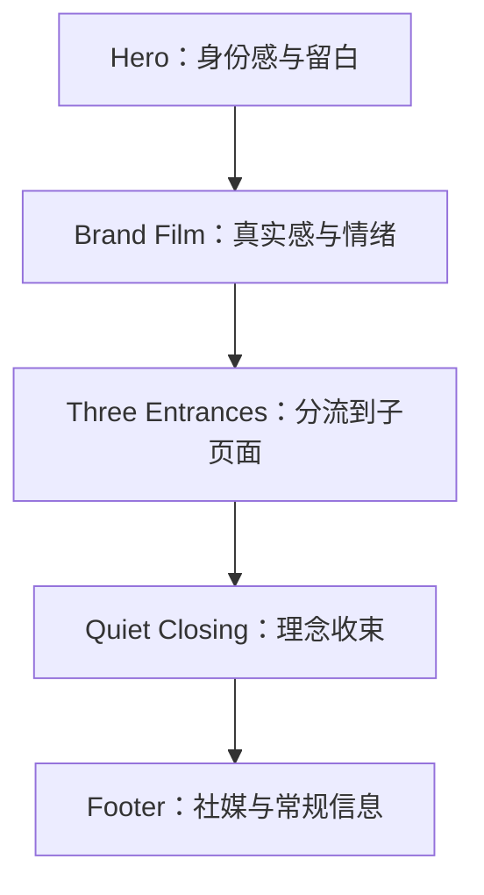
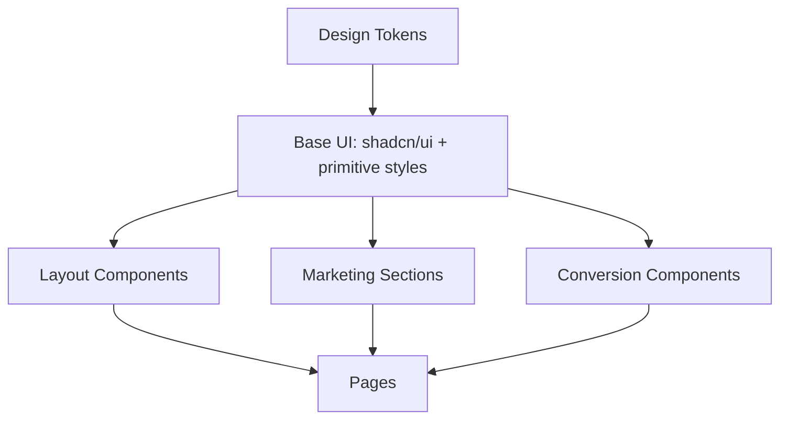

# 组件与设计系统规划 v0

更新时间：2026-06-11

## 一句话结论

首版设计系统应服务“克制的线下生活方式会员会所”，而不是做一套通用企业站 UI。组件要少而稳定，基础交互优先使用 shadcn/ui，品牌表达通过自定义业务组件、暖色 tokens、留白、真实影像和克制动效完成。

## 本文档目的

本文件承接：

- `docs/官网建设蓝图 v0.md`
- `docs/网站结构与页面规划 v0.md`
- `docs/网站设计调研.md`
- `docs/行动教育 Design.md`

它要解决的问题是：

- 哪些组件直接用 shadcn/ui；
- 哪些组件需要业务封装；
- 每个组件承担什么页面任务；
- 组件状态、响应式、空内容和可访问性怎么处理；
- 设计 tokens 如何服务暖色、克制、会员会所感；
- 动效边界如何落到组件层；
- 后续 Next.js 工程如何拆目录。

## 设计 thesis

### Visual Thesis

暖白底色、香槟金细节、胡桃木和柔和光线，形成一个连续的会员会所空间；页面像从一整块暖色材质里雕刻出来，而不是由多个 section 拼接。内容以墙面铭牌、嵌入式影像和门洞式入口自然出现。

### Content Plan



### Interaction Thesis

动效只做三类：

1. 首屏文字、CTA 和主视觉的轻淡入，制造进入感。
2. 图片和视频模块的慢速 reveal，强调材质和真实感。
3. 菜单、弹窗、按钮和步骤切换的轻过渡，提升精致感。

不做软件官网式炫技动效，不用粒子、强 3D、复杂 WebGL 或每屏滚动动画。

## 设计系统原则

| 原则 | 说明 |
|---|---|
| 少组件 | 组件数量宁少勿多，先保证克制首页和申请页稳定 |
| 少卡片 | 默认用区块、列、分隔线、图片和排版组织内容；只有重复项或表单容器才用卡片 |
| 连续空间 | 首页避免明显横向 section 切割，背景、光影和材质应贯穿全页 |
| 强留白 | 高级感来自节奏和克制，不来自装饰密度 |
| 真实素材优先 | 真实视频、真实空间、真实产品和真实服务证据优先于抽象图 |
| 主 CTA 统一 | 全站主行动保持 `申请会员`，但首页首屏不强推 |
| 缺素材留空 | 不用 mock 数据掩盖内容缺口 |
| 组件有状态 | 所有交互组件必须定义 hover、focus-visible、active、disabled、loading、error |
| 可访问可验证 | Header、Sheet、Dialog、表单、社媒链接必须键盘可达 |

## Token 体系 v0

实现时建议用 CSS variables + Tailwind theme 映射。这里先定义语义 tokens，开发时不要把 raw hex 散落在组件里。

### Color Tokens

| Token | 建议值 | 用途 |
|---|---|---|
| `--tj-bg` | `#F8F3EA` | 页面主背景，暖白 |
| `--tj-bg-soft` | `#FFFBF4` | 柔和浅底区块 |
| `--tj-bg-muted` | `#EFE5D6` | 分隔区、淡背景 |
| `--tj-surface` | `#FFFFFF` | 表单、弹窗、少量卡片 |
| `--tj-text` | `#2E261F` | 主文字 |
| `--tj-text-muted` | `#75695E` | 次级说明 |
| `--tj-text-subtle` | `#A09182` | 辅助信息、注释 |
| `--tj-accent` | `#B8894D` | 主行动色，香槟金/铜金 |
| `--tj-accent-strong` | `#8F6334` | hover/active |
| `--tj-accent-soft` | `#E7D3B4` | 轻强调、线条 |
| `--tj-wood` | `#5A3926` | 深色页脚或材质强调 |
| `--tj-border` | `#DED1BF` | 默认边框 |
| `--tj-focus` | `#7A522B` | focus-visible ring |
| `--tj-danger` | `#A33A2B` | 错误态 |
| `--tj-success` | `#5E7A45` | 成功态 |

使用规则：

- 主视觉不能读成纯黑金夜店风，深色只用于 Footer、文字或局部材质。
- `--tj-accent` 只服务 CTA、焦点和少量线条，不应用满屏金色。
- 正文灰色必须通过对比度测试，不能用太浅的米灰承载正文。
- 行动教育原来的蓝色 `#104198` 不作为本项目主色，只可作为历史参考。

### Typography Tokens

| Token | 建议 | 用途 |
|---|---|---|
| `--font-sans` | `SF Pro SC, PingFang SC, Helvetica Neue, Arial, sans-serif` | 全站中文系统字体 |
| `--font-serif` | 可选：`Noto Serif SC, Songti SC, serif` | 少量理念大标题，可不用 |
| `--text-xs` | `12px` | 注释、辅助信息 |
| `--text-sm` | `14px` | 导航、按钮、小段说明 |
| `--text-md` | `16px` | 正文 |
| `--text-lg` | `18px` | 区块引导 |
| `--text-xl` | `24px` | 小标题 |
| `--text-2xl` | `32px` | 区块标题 |
| `--text-hero` | `52px-72px` | 桌面首屏标题 |

使用规则：

- 不随 viewport 宽度线性缩放字体。
- 移动端 hero 标题建议 `36px-42px`，保证 2-4 行内可读。
- 字间距默认 `0`，不使用负字距。
- 大标题数量要少，页面内部紧凑区域不用 hero 级字号。

### Spacing Tokens

| Token | 建议值 | 用途 |
|---|---:|---|
| `--space-1` | `4px` | 极小间距 |
| `--space-2` | `8px` | 图标与文字 |
| `--space-3` | `12px` | 小控件内部 |
| `--space-4` | `16px` | 常规元素 |
| `--space-5` | `24px` | 组内间距 |
| `--space-6` | `32px` | 小区块 |
| `--space-7` | `48px` | 区块内部 |
| `--space-8` | `72px` | 区块上下 |
| `--space-9` | `112px` | 大段落留白 |

使用规则：

- 首页区块之间使用 `72px-112px` 的呼吸感。
- 移动端区块上下可收敛到 `48px-72px`。
- 不使用零散一次性间距。

### Layout Tokens

| Token | 建议值 | 用途 |
|---|---:|---|
| `--container-sm` | `960px` | 长文、理念页 |
| `--container-md` | `1120px` | 常规内容 |
| `--container-lg` | `1280px` | 首页图文区 |
| `--header-height` | `72px` | 桌面 Header |
| `--header-height-mobile` | `60px` | 移动 Header |
| `--hero-min-height` | `calc(100svh - var(--header-height))` | 首屏 |

使用规则：

- Hero 可以 full-bleed，但文字列需要 max-width 约 `560px`。
- 常规区块用居中容器，避免满屏文字散开。
- 图片、视频、步骤、Footer 要有稳定尺寸，避免加载时布局跳动。

### Radius / Shadow Tokens

| Token | 建议值 | 用途 |
|---|---:|---|
| `--radius-xs` | `2px` | 分隔、细节 |
| `--radius-sm` | `4px` | 按钮、小控件 |
| `--radius-md` | `8px` | 视频封面、表单容器 |
| `--shadow-soft` | `0 18px 60px rgba(65, 43, 24, 0.08)` | 弹窗或少量浮层 |

使用规则：

- 卡片和按钮圆角控制在 `4px-8px`。
- 不做大圆角 SaaS 风。
- 阴影要少用，优先用留白和背景层级。

### Motion Tokens

| Token | 建议值 | 用途 |
|---|---:|---|
| `--motion-fast` | `160ms` | hover、active |
| `--motion-base` | `240ms` | Sheet、按钮、链接 |
| `--motion-slow` | `520ms` | section reveal |
| `--ease-soft` | `cubic-bezier(0.22, 1, 0.36, 1)` | 主缓动 |

使用规则：

- 所有动效必须尊重 `prefers-reduced-motion`。
- 首屏入场总时长不应超过 `900ms`。
- 滚动 reveal 不应让内容等待太久才可读。

## shadcn/ui 使用边界

### 直接使用

| 需求 | shadcn 组件 | 用法 |
|---|---|---|
| 主按钮、次按钮 | `Button` | 定义项目 variants |
| 移动端菜单 | `Sheet` | Header 抽屉 |
| 视频播放弹窗 | `Dialog` | Brand Film |
| 表单字段 | `Form`、`Input`、`Textarea` | 申请意向表单，如果首版需要 |
| 视频比例 | `Aspect Ratio` | 视频封面和图片比例 |
| 分隔线 | `Separator` | Footer、分区细线 |
| 悬浮说明 | `Tooltip` | 只用于图标按钮 |
| 状态标识 | `Badge` | 少量“待确认”“会员路径”等标签 |

### 谨慎使用

| 组件 | 风险 | 使用规则 |
|---|---|---|
| `Card` | 容易变成 SaaS 卡片墙 | 只用于重复项或表单容器，不用于每个 section |
| `Carousel` | 容易成为无意义轮播 | 只有真实多图故事时再用 |
| `Accordion` | 容易隐藏关键信息 | 可用于申请页 FAQ，不用于核心价值 |
| `Navigation Menu` | 对简单官网可能过重 | 首版简单导航可直接自定义 nav + Sheet |

### 不需要使用

- `Pagination`：首版没有列表页。
- `Data Table`：首版没有表格型数据。
- `Command`：首版不需要命令面板。
- `Calendar`：首版不涉及预约系统。

## 组件分层



### 建议目录

```text
src/
  app/
    page.tsx
    apply/page.tsx
    membership/page.tsx
    philosophy/page.tsx
    about/page.tsx
  components/
    ui/
    layout/
      site-header.tsx
      site-footer.tsx
      section-shell.tsx
    sections/
      home-hero.tsx
      brand-film-section.tsx
      membership-intro.tsx
      supply-chain-proof.tsx
      membership-journey.tsx
      lifestyle-scenes.tsx
      philosophy-section.tsx
      final-cta.tsx
    conversion/
      apply-member-cta.tsx
      apply-flow.tsx
      apply-form-placeholder.tsx
    shared/
      social-links.tsx
      responsive-image.tsx
      section-heading.tsx
  lib/
    site-config.ts
    content-placeholders.ts
```

目录规则：

- `components/ui/` 只放 shadcn 生成或基础 UI。
- `components/sections/` 放页面区块。
- `components/conversion/` 放申请相关组件。
- `site-config.ts` 管理社媒链接、导航、外链和待补字段。
- 不要把文案散落在组件里，后续 PRD 后可抽成内容配置。

## 基础组件规则

### Button

来源：shadcn `Button`。

Variants：

| Variant | 用途 | 样式方向 |
|---|---|---|
| `primary` | 申请会员主按钮 | 香槟金底、深色文字或暖白文字 |
| `secondary` | 了解会员体系、观看影片 | 透明或浅底，细边框 |
| `ghost` | Header 普通链接 | 无背景，hover 轻底色 |
| `text` | Footer 或正文链接 | 下划线或细微颜色变化 |

状态：

- default：清晰可点击；
- hover：背景略深或边框增强；
- focus-visible：必须有 `--tj-focus` ring；
- active：轻微下压或色阶变化；
- disabled：降低透明度，保留可读文本；
- loading：保留按钮宽度，显示 loading indicator；
- error：仅用于表单提交失败后的相关操作。

规则：

- 主 CTA 文案统一为 `申请会员`。
- 按钮高度桌面建议 `44px-48px`，移动端不低于 `44px`。
- Header 中 CTA 可以更紧凑，但触控面积必须达标。
- 同一视口内不要出现超过 2 个强主按钮。

### Link

用途：导航、Footer、社媒、正文辅助链接。

规则：

- 外链必须 `target="_blank"` + `rel="noopener noreferrer"`。
- 社媒图标链接必须有 `aria-label`。
- hover 不能只依赖颜色变化，建议增加下划线或透明底。
- focus-visible 必须可见。

### SectionShell

用途：统一区块宽度、上下留白和背景。

Props 建议：

- `variant`: `default | soft | fullBleed | dark`
- `size`: `sm | md | lg`
- `id`: 用于锚点导航

规则：

- 默认不渲染卡片外壳。
- full-bleed 只用于 Hero、视频或大图氛围区。
- dark 只用于 Footer 或少量收束区，不做全站黑金。

### SectionHeading

用途：统一区块标题、说明文案。

结构：

- eyebrow：可选；
- title：必填；
- description：可选。

规则：

- 每个区块标题只讲一个任务。
- description 控制在 1-2 句。
- 不要在界面里解释“这个区块的功能是什么”。

## 业务组件规则

### SiteHeader

任务：提供品牌识别、导航和随时可达的申请入口。

组成：

- Logo/品牌名；
- 桌面导航；
- 主 CTA `申请会员`；
- 移动端菜单按钮；
- 移动端 Sheet。

shadcn：

- 可使用 `Sheet`；
- 简单导航可自定义，不必强用 `Navigation Menu`。

桌面规则：

- Header 高度约 `72px`；
- 背景可半透明暖白，滚动后加轻边框或轻 blur；
- 导航项最多 5 个；
- CTA 放右侧。

移动规则：

- 高度约 `60px`；
- Logo 左侧；
- 右侧保留小尺寸 `申请会员` 或菜单按钮；
- Sheet 中重复完整导航和 CTA；
- 打开菜单后焦点进入 Sheet，关闭后回到菜单按钮。

状态：

- sticky 状态：滚动后增加边框；
- active section：可轻微强调当前锚点；
- loading：不需要；
- error：不需要。

可访问性：

- 菜单按钮必须有 `aria-label`；
- 移动菜单必须支持 ESC 关闭；
- 键盘 Tab 顺序与视觉顺序一致。

### HomeHero

任务：第一屏建立身份感、会所感和申请入口。

组成：

- 品牌名或 Logo；
- 主标题；
- 一句辅助说明；
- 主 CTA；
- 次 CTA；
- 主视觉图像或暖色空间视觉。

布局：

- 桌面：full-bleed 背景或宽幅视觉平面，文字列宽约 `520px-600px`；
- 移动：文字优先，图片不压迫 CTA；
- Hero 高度应考虑 Header，避免首屏内容被截断。

状态：

- image loading：使用稳定背景色和 aspect ratio；
- missing image：保留文字布局，不展示假图；
- no logo：使用文字品牌名。

动效：

- 标题和 CTA 轻淡入；
- 主视觉轻微上浮或 reveal；
- 不做背景视频自动播放。

反模式：

- Hero 卡片；
- 商品图瀑布；
- 数字战报；
- 多按钮堆叠；
- 霓虹或科技粒子。

### BrandFilmSection

任务：展示品牌影片，建立真实感和情绪价值。

组成：

- 视频封面；
- 播放按钮；
- 一句说明；
- Dialog 或原位播放器。

shadcn：

- `Dialog`
- `Aspect Ratio`
- `Button`

规则：

- 不自动播放声音；
- 不作为首屏背景；
- 默认使用视频封面，点击后播放；
- 视频区域比例建议 `16:9` 或接近素材实际比例；
- 缺封面时可从视频截帧生成，不用无关图库。

状态：

- loading：显示封面骨架或暖色底；
- error：显示“视频暂不可播放”与备用说明；
- reduced motion：不做复杂 reveal。

可访问性：

- 播放按钮必须有文本或 `aria-label`；
- Dialog 打开后焦点进入播放器区域；
- ESC 可关闭。

### MembershipIntro

任务：解释天机优选是什么。

首页策略调整后：优先用于 `/membership` 或 `/philosophy`，不作为首页必选区块。

组成：

- 定义型标题；
- 2-3 段短文；
- 可选真实图片；
- 次 CTA。

布局：

- 桌面左右分栏；
- 移动端单列；
- 不做多卡片功能墙。

空内容：

- 如果真实图片缺失，保留文字区块，不用假图。

### SupplyChainProof

任务：把供应链转译成信任证据，而不是后台炫耀。

首页策略调整后：优先用于 `/philosophy` 或 `/membership`，不作为首页必选区块。

组成：

- 标题；
- 说明；
- 3-4 个证据点；
- 可选证明素材。

证据点方向：

- 稳定来源；
- 精选机制；
- 减少试错；
- 线下体验承接；
- 长期服务。

规则：

- 不写无来源数字；
- 不使用“直供超值”“全网最低”等电商口吻；
- 右侧证据素材缺失时保持留空或待补状态。

### MembershipJourney

任务：说明申请后发生什么，降低未知感。

首页策略调整后：优先用于 `/apply`，不作为首页必选区块。

组成：

- 4 步流程：了解、申请、确认、进入会员体验；
- 每步短说明；
- CTA。

布局：

- 桌面横向步骤；
- 移动端纵向步骤；
- 使用线条和编号，不使用厚重卡片。

状态：

- pending business rule：用待确认注释标记，不在用户界面展示假的审核逻辑；
- long text：每步最多 2 行，超出需要重写文案。

动效：

- 进入视口后按顺序轻淡入；
- 不做复杂 timeline 动画。

### LifestyleScenes

任务：展示会员身份对应的生活方式。

首页策略调整后：没有真实素材前不作为首页必选区块。首页可以只保留氛围，生活方式细节后续放到子页面。

组成：

- 4 个场景：品质消费、线下体验、内容洞察、可信关系；
- 图片；
- 场景标题；
- 一句说明。

布局：

- 桌面 2x2；
- 平板 2 列；
- 手机单列；
- 图片比例稳定，建议 `4:3` 或 `3:2`。

规则：

- 无真实素材时，不展示假活动墙；
- 每个场景文案克制，不写“尊享”“顶级”“奢华”；
- 图片要承担叙事，不用抽象渐变图。

### PhilosophySection

任务：表达品牌理念，触动隐性需求。

首页策略调整后：完整理念优先放到 `/philosophy`；首页只保留 `QuietClosing`。

组成：

- 大标题；
- 2-3 段短文；
- 可选静物/空间图；
- 轻 CTA。

布局：

- 大留白；
- 可用窄内容宽度 `--container-sm`；
- 不使用口号墙。

规则：

- 语言要像邀请，不像宣言；
- 可以说“不适合所有人”，但不能制造阶层焦虑。

### ApplyMemberCTA

任务：统一申请入口。

组成：

- 标题；
- 一句降低顾虑的说明；
- 主按钮；
- 可选次按钮。

使用位置：

- Hero；
- Membership Journey；
- Final CTA；
- Footer；
- Apply page。

规则：

- 主按钮统一指向 `/apply`；
- 外链商城前先经过申请页说明；
- CTA 文案不使用 `立即注册` 作为主按钮。
- 首页首屏不使用强主按钮压迫用户，Header 和 Three Entrances 可保留轻量入口。

### HomeEntrances

任务：作为首页的核心分流区，把用户带到更适合承接解释的子页面。

组成：

- 会员体系入口；
- 理念与价值入口；
- 申请会员入口。

布局：

- 桌面三列或三扇门洞式入口；
- 移动端单列；
- 每个入口标题 + 一句短说明 + 轻箭头；
- 可用细边框、分隔线或极轻背景，不做厚重卡片。

规则：

- 三个入口视觉权重接近；
- `申请会员` 不做成唯一强按钮；
- 每个入口只承担一个方向；
- 不在入口内展开长文解释。
- 在连续空间型首页里，入口应更像路径、门洞、墙面刻痕，而不是卡片。

### QuietClosing

任务：用一句品牌理念安静收束首页。

组成：

- 一句理念；
- 可选短说明；
- 可选静物/空间氛围图。

布局：

- 大留白；
- 窄文本宽度；
- 不放流程、权益、供应链解释。

推荐语气：

- 克制；
- 像邀请；
- 有门槛感；
- 不制造销售压力。

### SocialLinks

任务：在 Footer 底部承接社媒外链，不抢主线。

组成：

- 社媒 Logo；
- 可访问名称；
- 外链 URL；
- 可选二维码。

平台：

- 公众号；
- 视频号；
- 小红书；
- 抖音；
- Bilibili，如有再展示。

规则：

- 缺 URL 的平台不展示；
- 不使用假链接；
- Logo 尺寸建议 `20px-28px`；
- hover 轻微变色或透明度变化；
- 外链新窗口打开；
- 移动端可换行。

### SiteFooter

任务：承接常规信息、社媒、合规和底部 CTA。

组成：

- 简短品牌说明；
- 页面链接；
- 社媒链接；
- 联系方式；
- 地址；
- 备案；
- 底部版权。

布局：

- 桌面 3-4 列；
- 移动端单列；
- 深色或暖白均可，推荐暖深棕或暖白，避免纯黑金。

空内容：

- 联系方式缺失则不展示该行；
- 备案缺失时标记待补，不编造；
- 社媒缺失则隐藏对应图标。

### ApplyFlow

任务：申请页解释流程。

组成：

- 流程步骤；
- 当前业务状态说明；
- CTA 或外链。

规则：

- 不承诺未确认审核规则；
- 不让用户误以为申请等于购买；
- 明确“申请是一次了解和确认”。

### ApplyFormPlaceholder

任务：在申请方式未确定时，承接待补状态。

使用条件：

- 商城注册链接未确定；
- 是否需要意向表单未确定；
- 表单字段未确定。

规则：

- 开发环境可显示待补提示；
- 面向真实用户上线前必须替换成真实入口或隐藏；
- 不收集用户信息，除非已经确认隐私和处理方式。

## 状态系统

所有交互组件必须至少考虑：

| 状态 | 规则 |
|---|---|
| default | 文案和操作清晰 |
| hover | 鼠标可感知，但不依赖 hover 传达关键信息 |
| focus-visible | 键盘可见焦点，颜色对比达标 |
| active | 有轻微反馈 |
| disabled | 可读但不可操作，说明原因 |
| loading | 保持尺寸稳定，避免布局跳动 |
| error | 错误说明与控件关联，不能只用颜色 |
| empty | 明确留空原因，不用假数据填充 |

## 空内容策略

项目当前仍缺不少真实素材，空内容策略必须写进组件规则。

| 缺口 | 组件行为 |
|---|---|
| Logo 缺失 | 使用文字品牌名，不生成假 Logo |
| Hero 主视觉缺失 | 保持留白和文字布局，可暂用草图方向，不用图库假图 |
| 视频封面缺失 | 从现有视频截帧生成或使用暖色占位 |
| 供应链证据缺失 | 保留文字框架，不写假数字 |
| 线下照片缺失 | 不展示 LifestyleScenes 图片墙 |
| 社媒链接缺失 | 隐藏对应 Logo |
| 联系方式缺失 | Footer 不展示该字段 |
| 申请入口缺失 | `/apply` 显示待接状态，不收集真实信息 |

## 响应式规则

### Breakpoints

| 断点 | 规则 |
|---|---|
| `< 640px` | 单列、Header 使用 Sheet、CTA 更大、视频不超过一屏高度 |
| `640px-1024px` | 图文区可 2 列，减少导航项，保持视频比例 |
| `> 1024px` | 完整导航、2 列/2x2 布局、Footer 多列 |

### 移动端必须检查

- 无横向滚动；
- Header 不遮挡 Hero；
- CTA 不小于 `44px` 高；
- 社媒 Logo 不挤压备案文字；
- 视频弹窗可关闭；
- 长标题不会溢出；
- 表单键盘弹出后仍可提交或关闭。

## 可访问性规则

目标：WCAG 2.2 AA。

必须满足：

- 所有交互元素可键盘访问；
- focus-visible 可见；
- 图片有合适 `alt`，装饰图可空 `alt=""`；
- 视频播放按钮有可访问名称；
- Dialog 和 Sheet 支持 ESC 关闭；
- 表单错误信息与字段关联；
- 外链有可理解名称；
- 文本对比度达标；
- 不依赖颜色作为唯一状态表达；
- `prefers-reduced-motion` 下关闭非必要动效。

## 动效规则

### 可用动效

| 动效 | 组件 |
|---|---|
| Hero entrance | `HomeHero` |
| Image reveal | `BrandFilmSection`、`LifestyleScenes` |
| Step reveal | `MembershipJourney` |
| Dialog presence | `BrandFilmSection` |
| Button micro interaction | `Button`、`ApplyMemberCTA` |
| Sheet transition | `SiteHeader` |

### 禁止动效

- 大面积粒子；
- 复杂 WebGL；
- 3D 卡片旋转；
- 自动播放背景视频；
- 每屏强制滚动叙事；
- 文字逐字出现影响阅读；
- hover 后才显示核心信息。

### Framer Motion 使用建议

首版只需要：

- `motion.div` section reveal；
- `AnimatePresence` 控制 Dialog/Sheet 过渡，如 shadcn 默认不足再补；
- `useReducedMotion` 判断是否关闭动效；
- 少量 `whileHover` 用于 CTA。

## 内容语气规则

### 应该使用

- 申请；
- 了解；
- 确认；
- 会员体系；
- 品质选择；
- 可信关系；
- 线下体验；
- 减少试错；
- 有秩序的生活方式。

### 避免使用

- 立即注册；
- 尊贵身份；
- 高端人脉；
- 提升圈层；
- 稀缺席位；
- 全网最低；
- 顶级资源；
- 私域割裂式话术。

## 组件优先级

### P0：首版必须

1. `Button`
2. `SiteHeader`
3. `HomeHero`
4. `BrandFilmSection`
5. `HomeEntrances`
6. `QuietClosing`
7. `ApplyMemberCTA`
8. `SocialLinks`
9. `SiteFooter`

### P1：首版建议

1. `MembershipIntro`
2. `SupplyChainProof`
3. `MembershipJourney`
4. `LifestyleScenes`
5. `PhilosophySection`
6. `ApplyFlow`
7. `ApplyFormPlaceholder`
8. `SectionShell`
9. `SectionHeading`

### P2：二期再做

1. `EventsPreview`
2. `InsightsList`
3. `MemberStories`
4. `FAQAccordion`
5. `ContentCard`

## 与 PRD 的关系

PRD v1 应直接引用本文件中的组件名，而不是重新描述一遍 UI。

示例：

```text
首页 Hero 使用 HomeHero 组件，主 CTA 使用 ApplyMemberCTA，跳转 /apply。
品牌影片使用 BrandFilmSection，视频源为 Video/天机优选 - 01.mp4。
Footer 使用 SiteFooter + SocialLinks，缺失社媒链接时隐藏对应 Logo。
```

## 工程初始化建议

技术栈：

`Next.js + TypeScript + Tailwind CSS + shadcn/ui + Framer Motion`

初始化后建议第一批安装：

```bash
npx shadcn@latest add button sheet dialog aspect-ratio separator badge tooltip input textarea form
```

如果首版暂不做表单，可以延后安装：

```bash
npx shadcn@latest add input textarea form
```

## QA Checklist

- [ ] 全站主 CTA 文案统一为 `申请会员`。
- [ ] Header 桌面端和移动端均可键盘操作。
- [ ] Hero 首屏没有卡片堆叠、商品货架或自动播放视频。
- [ ] BrandFilmSection 可播放现有视频，失败时有错误态。
- [ ] MembershipJourney 移动端纵向显示，无文字溢出。
- [ ] SupplyChainProof 没有使用无来源数字或电商促销口吻。
- [ ] LifestyleScenes 没有用假活动图填充。
- [ ] SocialLinks 缺链接时隐藏对应平台。
- [ ] Footer 的联系方式、备案和社媒在手机端可读。
- [ ] 所有按钮有 hover、focus-visible、active、disabled、loading 状态。
- [ ] 所有外链使用 `rel="noopener noreferrer"`。
- [ ] 所有动效支持 `prefers-reduced-motion`。
- [ ] 页面不依赖 hover 才能获得关键信息。
- [ ] Lighthouse 目标：Accessibility 90+，SEO 90+，Performance 80+。

## 下一步

完成本文件后，建议继续产出：

1. `内容资产清单 v0.md`：列出每个组件需要哪些素材、已有素材在哪里、缺什么。
2. `PRD v1.md`：把页面、组件、文案字段、待补项和验收标准转成开发任务。
3. `技术选型与工程方案 v0.md`：确定目录结构、依赖安装、shadcn 初始化和开发流程。
