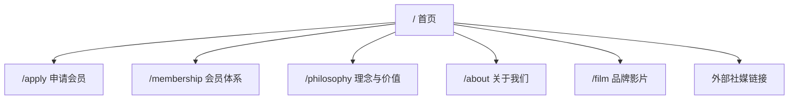
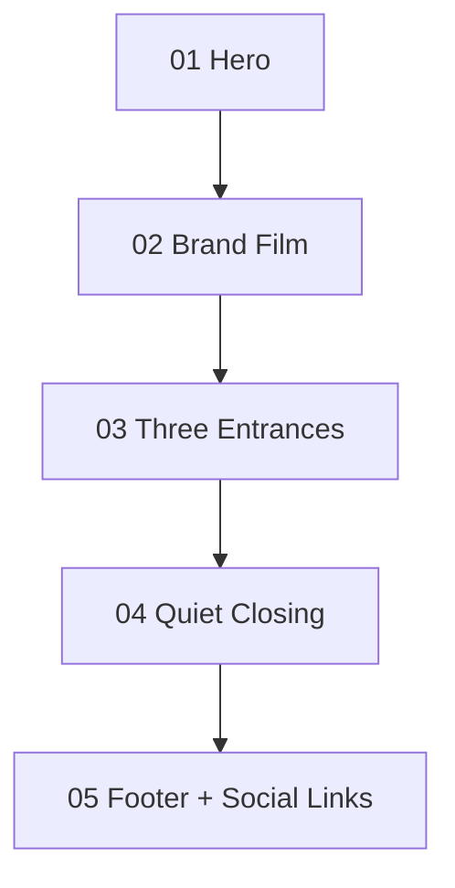
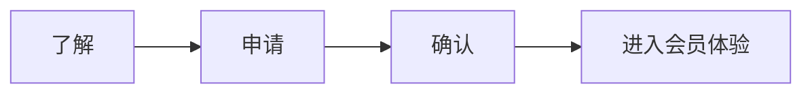
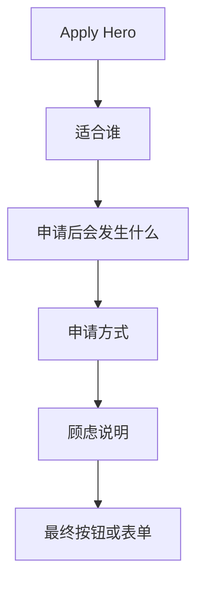
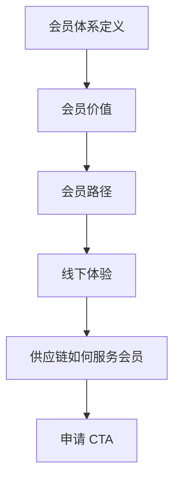

# 网站结构与页面规划 v0

更新时间：2026-06-11

## 一句话结论

首版官网建议采用“少页面、克制首页、子页面承接解释”的结构：首页不做完整说明书，而是像一个门厅或邀请函，负责建立气质、制造兴趣和给出分流入口；会员体系、供应链、申请流程等细节交给子页面承接。

这不是一个内容很多的企业站，也不是商品很多的商城站，更不是标准 landing page。它应该像一个连续的会员会所空间：用户看完后不是“被解释完了”，而是觉得“这里有门槛、有气质，值得进一步进入”。

## 首页艺术方向：连续空间型

首页不是一段段 section 拼接，而是一整块材料里雕出来的空间。

核心判断：

| 模块拼接型 | 连续空间型 |
|---|---|
| Hero、视频、入口、理念彼此分块 | 全页共享同一背景、光影和材质 |
| 视频像一个嵌入页面的 banner | 视频像墙体里嵌入的一件作品 |
| 三入口像三张卡片 | 三入口像三扇门或三条路径 |
| 文案像每段 section 的标题 | 文案像墙面铭牌或空间里的刻痕 |
| Footer 突然切换 | Footer 像空间自然收边 |

执行原则：

- 使用同一套暖白材质、纸感、光影和阴影贯穿全页；
- 减少水平分隔线和大块背景切换；
- 保留内容线索，但让它们像嵌入空间，而不是模块说明；
- 视频、入口、理念都要从同一空间里“生长出来”；
- 参考草图：`images/草图/homepage-pc-continuous-space-direction.png`。

## 本文档目的

本文件承接：

- `docs/官网建设蓝图 v0.md`
- `docs/官网前期需求对齐.md`
- `docs/网站设计调研.md`
- `docs/行动教育 Design.md`

它要解决的问题是：

- 首版官网到底有几个页面；
- 首页每一屏承担什么任务；
- 每个页面如何布局；
- CTA 如何分布；
- 社媒入口放在哪里；
- 哪些内容要留空等待真实素材；
- 参考网站和行动教育 Design 还能怎么用。

## 参考网站与 Design 的使用边界

最开始参考的行动教育官网和 `docs/行动教育 Design.md` 仍然有价值，但不能继续作为最终审美方向。

| 来源 | 还能用什么 | 不再照搬什么 |
|---|---|---|
| 行动教育参考网站 | Header、栏目、内容区、Footer、移动端基础结构 | 蓝白企业教育气质、案例卡片密度、强企业宣传感 |
| `行动教育 Design.md` | token 意识、组件状态、可访问性、响应式、QA 清单 | `#104198` 蓝色主视觉、documentation site 定位 |
| `网站设计调研.md` | shadcn/ui 组件选型、业务组件封装方法 | 行动教育式课程/案例模板 |
| `官网建设蓝图 v0.md` | 营销路径、隐性需求、消除顾虑、动效边界 | 无，作为本阶段上层依据 |

判断原则：

> 参考网站负责“官网骨架参考”，不负责“品牌气质”；Design 文档负责“实现规范参考”，不负责“最终审美”。

## 推荐站点地图

首版建议控制在 6 个页面以内，避免一开始做成空内容很多的企业站。`/film` 可以作为独立内容页承接品牌影片，不强行塞进首页首屏。

### 页面清单

| 页面 | 路由建议 | 首版优先级 | 主要任务 |
|---|---|---:|---|
| 首页 | `/` | P0 | 建立气质、制造兴趣、给出分流入口 |
| 申请会员页 | `/apply` | P0 | 承接 CTA，说明申请路径，连接商城或意向提交 |
| 会员体系页 | `/membership` | P1 | 更完整解释会员价值、路径、适配人群 |
| 理念与价值页 | `/philosophy` | P1 | 解释供应链、品质选择、线下体验、可信关系 |
| 品牌影片页 | `/film` | P1 | 独立承接品牌影片、封面、影片说明和后续内容 |
| 关于我们 | `/about` | P1 | 公司信息、联系方式、地址、备案、基础信任 |
| 社媒链接 | 外链 | P0 | 放在首页底部/Footer，点击跳转外部平台 |
| 活动/私董会页 | `/events` | P2 | 等真实活动素材充足后再做 |
| 内容/文章页 | `/insights` | P2 | 等内容资产稳定后再做 |

### 首版最小可交付

如果希望最快进入开发，首版可以先做：

- 首页 `/`
- 申请会员页 `/apply`
- Footer 中预留关于、理念、社媒和联系方式入口

首页只保留极少量入口和氛围；会员体系、理念与价值、关于我们可以先做简单子页面或锚点页，避免把所有解释塞回首页。

## 全站导航结构

### 桌面端 Header

推荐导航：

| 导航项 | 指向 | 备注 |
|---|---|---|
| Logo | `/` | Logo 待补，首版可用文字标识 |
| 会员体系 | `/#membership` 或 `/membership` | 首版可先锚点，二期拆页 |
| 品牌影片 | `/film` 或 `/#film` | 内容不足时先锚点，影片页确认后独立路由 |
| 理念与价值 | `/#philosophy` 或 `/philosophy` | 首版可先锚点 |
| 关于我们 | `/about` 或 `/#about` | 信息不足时先放 Footer |
| 申请会员 | `/apply` | 主 CTA |

### 移动端 Header

移动端使用抽屉菜单：

- 顶部保留 Logo 和 `申请会员` 按钮；
- 菜单图标打开 Sheet；
- 菜单项不超过 5 个；
- CTA 在菜单底部重复出现；
- 必须支持 ESC 关闭、焦点回收、键盘可达。

## 首页结构

首页不再承担大部分解释和转化任务。推荐 5 个区块：Hero、Brand Film、三个入口、克制收束、Footer。首页的任务是“让人愿意继续进入”，不是把所有信息一次讲完。

### 首页内容密度判断

当前首页方向不需要增加更多“板块”，但需要增加更准确的“线索密度”。

可以增加：

- 墙面铭牌式短句：用 4-8 个字提示身份感、选择、信任、线下关系；
- 影片嵌入区的极短说明：只交代影片为什么值得看，不做按钮式催促；
- 三个门洞入口的短说明：每个入口只回答“进去后会看到什么”；
- 底部自然收束语：像会所出口处的一句话，而不是营销口号。

不建议增加：

- 权益卡片墙；
- 商品图墙；
- 供应链流程图；
- 大段公司介绍；
- 多个强 CTA。

判断标准：用户看完首页后不一定已经理解全部业务，但应该知道“这里是什么气质、是否适合我、下一步从哪扇门进入”。

### 01 Hero

目标：在 5 秒内建立“线下生活方式会员会所”的第一印象。

心理任务：

- 建立身份感；
- 让用户感到被邀请；
- 不解释太多；
- 不强推申请。

桌面布局：

- 标题、说明和极轻微的向下提示嵌入连续空间；
- 右侧或背景区域使用暖色会所感图像；
- 大量留白；
- 不放视频自动播放；
- 不放卡片堆叠；
- 不在首屏放功能按钮。

移动布局：

- 标题优先；
- 图片放在文字下方或作为淡背景；
- 保留轻微向下提示；
- 不在首屏堆叠按钮。

内容元素：

- 品牌名；
- 主标题；
- 一句辅助说明；
- 一个极轻的向下滚动提示；
- `申请会员` 可以保留在 Header 右上角，但应轻，不做首屏最大按钮。

待补素材：

- 正式 Logo；
- 首屏主视觉；
- 最终 slogan。

### 02 Brand Film

目标：用现有视频建立真实感和情绪价值。

心理任务：

- 证明品牌不是空概念；
- 给用户一个慢下来理解品牌的入口；
- 替代首屏背景视频，避免干扰第一 CTA。

布局建议：

- 大尺寸视频封面；
- 中央播放按钮；
- 视频下方只放一句简短说明；
- 不自动播放声音；
- 弹窗播放或原位播放均可。

素材：

- `Video/天机优选 - 01.mp4`
- `images/Style reference/视频封面.png`

待补素材：

- 视频标题；
- 视频简介。

### 03 Three Entrances

目标：把用户分流到三个更适合承接解释的子页面，而不是在首页一次讲完。

心理任务：

- 给用户选择权；
- 让首页保持克制；
- 让不同兴趣的人进入不同路径。

推荐三个入口：

| 入口 | 指向 | 任务 |
|---|---|---|
| 会员体系 | `/membership` | 解释会员价值、路径和适配人群 |
| 理念与价值 | `/philosophy` | 解释品牌理念、供应链与生活方式关系 |
| 申请会员 | `/apply` | 承接低压力轻量意向 |

布局建议：

- 三个入口可以是极简图文链接，不做厚重卡片墙；
- 每个入口只写一个标题和一句短说明；
- `申请会员` 可以是其中一个入口，但不要在视觉上压倒前两个；
- 移动端纵向排列。

### 04 Quiet Closing

目标：用一句克制的品牌理念收束首页，而不是再堆卖点。

布局建议：

- 大量留白；
- 一句理念文案；
- 可选一张静物或空间氛围图；
- 不放流程、不放权益、不放供应链解释。

推荐表达方向：

> 选择，是一种秩序；连接，是一种力量；共益，是一种未来。

### 03 What is Tianji

目标：回答“天机优选到底是什么”。

心理任务：

- 从会所感过渡到业务解释；
- 让用户理解不是普通商城；
- 建立“会员体系”的基本认知。

布局建议：

- 一句定义型标题；
- 2-3 段短文；
- 可以使用一张真实生活方式图片；
- 不要做多卡片功能墙。

推荐表达方向：

> 天机优选不是普通商城，而是一个把品质消费、线下体验与可信关系整理在一起的会员系统。

首页策略调整后，本模块不再作为首页必选区块，优先放到 `/membership` 或 `/philosophy`。

### 04 Why Trust

目标：解释为什么用户可以信任这套会员体系。

心理任务：

- 把供应链从“后台能力”转成“用户价值”；
- 降低“不真实”“包装感”的顾虑；
- 说明稳定品质和减少试错的来源。

布局建议：

- 采用左右分栏；
- 左侧讲供应链如何服务会员；
- 右侧放证据型内容，缺素材时留空；
- 不放夸张数字，除非有真实来源。

可讲内容：

- 稳定来源；
- 筛选机制；
- 线下体验；
- 长期服务；
- 减少试错。

待补素材：

- 供应链真实说明；
- 真实合作/场景素材；
- 可公开的资质或证明。

首页策略调整后，本模块不再作为首页必选区块，优先放到 `/philosophy` 或 `/membership`。

### 05 Membership Journey

目标：让用户知道申请会员后会发生什么。

心理任务：

- 降低麻烦感；
- 降低被销售感；
- 把申请会员变成清晰、体面的下一步。

推荐流程：

布局建议：

- 4 步横向流程，移动端纵向；
- 每一步 1 句说明；
- 不写未确认的审核承诺；
- 不写虚构权益。

待确认：

- 是否审核；
- 是否顾问联系；
- 是否直接跳商城；
- 申请字段有哪些。

首页策略调整后，本模块不再作为首页必选区块，优先放到 `/apply`。

### 06 Lifestyle Scenes

目标：让用户看见“会员身份带来的生活方式”。

心理任务：

- 激发向往；
- 但不直白炫耀；
- 用真实场景替代抽象卖点。

建议场景：

| 场景 | 表达重点 |
|---|---|
| 品质消费 | 稳定、精选、减少试错 |
| 线下体验 | 会所、餐叙、品鉴、生活方式 |
| 内容洞察 | 认知、审美、选择标准 |
| 可信关系 | 同频、长期、自然连接 |

布局建议：

- 2x2 图文区块；
- 图片优先，文字克制；
- 无真实素材时不要用假活动图填充。

首页策略调整后，本模块不再作为首页必选区块。没有真实素材时，首页只保留氛围，不做生活方式图墙。

### 07 Philosophy

目标：表达品牌理念，而不是继续堆权益。

心理任务：

- 说出隐性需求；
- 建立价值观共鸣；
- 让用户感到“这个品牌懂我”。

可表达主题：

- 生活里的好选择，不应该依赖偶然；
- 会员制意味着彼此选择；
- 克制、真实、长期，比热闹更重要；
- 供应链最终服务的是人的生活秩序。

布局建议：

- 大段留白；
- 1 个大标题 + 2-3 段短文；
- 可加入一张暖色静物/空间图；
- 不要做口号墙。

首页策略调整后，本模块可压缩为 Quiet Closing；完整理念放到 `/philosophy`。

### 08 Final CTA

目标：在用户理解价值和顾虑被降低后，给出自然行动入口。

心理任务：

- 不逼迫；
- 让用户觉得可以先往前走一步；
- 再次强调申请路径低压力。

推荐文案方向：

> 如果你认同这种生活方式，可以从一次申请开始。

按钮：

- 主按钮：`申请会员`
- 次按钮：`预约了解` 或 `返回品牌影片页`

首页策略调整后，Final CTA 不作为首页必选强区块。申请入口可以作为 Three Entrances 的第三项，以及 Header 的轻入口。

### 09 Footer + Social Links

目标：承接官网常规信息与社媒入口，不抢首页主线。

你的判断是对的：社媒入口直接放首页最底部/Footer 即可，用社媒 Logo 做超链接重定向，这是大多数官网的常规做法。

布局建议：

- Footer 上半部分放简短品牌说明；
- Footer 中部放页面链接；
- Footer 右侧或底部放社媒 Logo；
- 最底部放联系方式、地址、备案等合规信息；
- 如果社媒链接未补齐，先不展示对应 Logo，不用假链接。

社媒 Logo 建议：

| 平台 | 处理 |
|---|---|
| 公众号 | 使用官方二维码或图标，待补 |
| 视频号 | 使用图标/二维码，待补 |
| 小红书 | 使用图标链接，待补 |
| 抖音 | 使用图标链接，待补 |
| Bilibili | 如有账号再展示 |

交互规则：

- 外链新窗口打开；
- 使用 `rel="noopener noreferrer"`；
- 每个 Logo 要有可访问名称，例如 `aria-label="前往天机优选小红书"`；
- Logo 不要大，不要做成营销模块；
- 移动端居左或居中排列均可，但不要挤压备案信息。

## 申请会员页结构

申请会员页是转化承接页，不是复杂表单页。

### Apply Hero

任务：

- 让用户确认自己来到正确页面；
- 语气像邀请，不像注册页。

推荐标题方向：

> 申请成为天机优选会员

辅助说明方向：

> 申请不是一次仓促决定，而是一次了解彼此是否适合的开始。

### 适合谁

任务：

- 帮用户自我筛选；
- 避免假装适合所有人。

建议写法：

- 重视品质选择；
- 希望减少试错；
- 认可线下体验和长期关系；
- 喜欢克制、真实、有秩序的生活方式。

### 申请后会发生什么

任务：

- 降低未知感；
- 降低被销售感。

流程示例：

1. 提交申请或进入商城登记；
2. 了解会员体系；
3. 完成必要确认；
4. 获得后续会员服务入口。

其中第 1 步和第 3 步需要等真实业务流程确认后再最终落文案。

### 申请方式

当前建议二选一或并存：

| 方式 | 适用情况 |
|---|---|
| 跳转商城注册 | 商城已经有稳定会员登记入口 |
| 提交轻量意向 | 需要顾问或人工承接 |

不建议在首版官网内实现完整会员系统。

### 顾虑说明

这一部分专门承接 Jason Fladlien 的“消除约束”思想。

建议回答：

- 申请是否等于购买；
- 是否会被反复推销；
- 是否需要审核；
- 信息会如何使用；
- 如果不确定是否适合，是否可以先了解。

如果业务暂未确定，不要编造承诺，写成待确认占位。

## 会员体系页结构

如果首版拆独立页，推荐结构：

注意：

- 不做过多等级卡片；
- 不编造权益；
- 不使用黑金会员卡视觉；
- 可以先作为首页区块存在。

## 理念与价值页结构

如果首版拆独立页，推荐结构：

- 我们为什么做会员制；
- 为什么品质选择需要稳定系统；
- 供应链、线下体验和可信关系如何连接；
- 我们不想成为怎样的平台；
- 申请会员 CTA。

这个页面应更安静、更克制，适合长一点的品牌文案。

## 关于我们页结构

关于我们页只放可验证信息。

建议模块：

- 品牌简介；
- 公司基础信息；
- 地址；
- 联系方式；
- 备案；
- 社媒入口；
- 申请会员 CTA。

不要编造：

- 团队规模；
- 发展历史；
- 合作品牌；
- 荣誉资质；
- 活动数据。

## CTA 分布

| 位置 | CTA | 目标 |
|---|---|---|
| Header | `申请会员` | 随时可达 |
| Hero | `申请会员` | 第一行动入口 |
| Brand Film | `了解会员体系` | 视频后继续理解 |
| Membership Journey | `查看申请方式` | 降低流程顾虑 |
| Final CTA | `申请会员` | 主要转化 |
| Footer | `申请会员` + 社媒链接 | 底部兜底 |

CTA 原则：

- 主 CTA 保持统一：`申请会员`；
- 不同区块可用次 CTA；
- 不要同时出现过多强按钮；
- 外链商城前最好经过申请页说明。

## 组件规划

首版业务组件建议：

| 组件 | 来源 | 说明 |
|---|---|---|
| `SiteHeader` | shadcn `Navigation Menu` + `Sheet` | 桌面导航、移动菜单、CTA |
| `HomeHero` | 自定义 | 大留白、主标题、首屏 CTA |
| `BrandFilmSection` | shadcn `Dialog` + `Aspect Ratio` | 视频封面、播放弹窗 |
| `MembershipIntro` | 自定义 | 解释“天机优选是什么” |
| `SupplyChainProof` | 自定义 | 供应链作为信任证据 |
| `MembershipJourney` | 自定义 | 4 步申请路径 |
| `LifestyleScenes` | 自定义 | 2x2 图文场景 |
| `PhilosophySection` | 自定义 | 品牌理念 |
| `ApplyMemberCTA` | shadcn `Button` | 统一 CTA |
| `SocialLinks` | 自定义 + 图标 | Footer 社媒入口 |
| `SiteFooter` | shadcn `Separator` | 页脚、备案、联系方式 |

基础组件优先使用 shadcn/ui，不重复造轮子。

## 素材缺口

| 区块 | 需要素材 | 当前处理 |
|---|---|---|
| Header | Logo | 待补 |
| Hero | 主视觉、slogan | 可先用草图方向，不用假 Logo |
| Brand Film | 视频封面 | 待补，可从视频截帧生成 |
| Why Trust | 供应链证明素材 | 待补 |
| Lifestyle Scenes | 线下空间、活动、产品、人物照片 | 无真实素材则不展示活动墙 |
| Apply Page | 申请入口、流程说明 | 待业务确认 |
| Footer | 社媒链接、二维码、联系方式、备案 | 待补，缺哪个不展示哪个 |

## 响应式布局原则

### 桌面端

- 最大内容宽度建议 `1120px-1280px`；
- 首屏留白充足；
- 图文区块使用 2 列；
- 生活方式场景可用 2x2；
- Footer 可 3-4 列。

### 平板端

- 图文区块可保持 2 列，但减小间距；
- Header 可提前收起部分导航；
- 视频模块保持宽比例。

### 手机端

- 所有区块单列；
- Header 使用抽屉；
- CTA 按钮宽度更大；
- 视频封面不超过一屏高度；
- Footer 社媒 Logo 一行放不下时换行；
- 不允许横向滚动。

## 不做清单

首版不要做：

- 商品货架；
- 会员等级炫耀卡；
- 黑金 VIP 卡视觉；
- 自动播放首屏视频；
- 大面积科技动效；
- 无真实来源的数字背书；
- 假活动照片；
- 复杂内容中心；
- 完整登录注册系统。

## 结构验收标准

- 首页能独立完成“理解品牌、建立信任、降低顾虑、申请会员”四个任务；
- 用户不点导航也能理解天机优选是什么；
- 申请会员路径清楚，不像普通注册页；
- 社媒入口在底部可见但不抢主线；
- 供应链作为信任证据出现，不作为首屏主卖点；
- 每个页面都有明确心理任务；
- 每个区块都有明确素材来源或待补标记；
- 移动端结构不比桌面端少关键信息。

## 下一步

完成本规划后，下一步建议进入 `PRD v1`：

1. 把每个页面拆成开发任务；
2. 明确每个区块的真实文案与待补字段；
3. 确认申请会员页是跳商城、提交意向，还是二者并存；
4. 再创建 Next.js 工程骨架。
