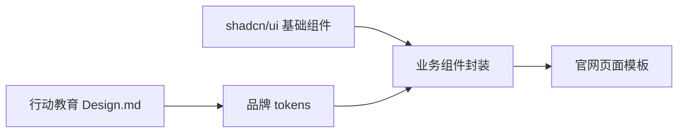
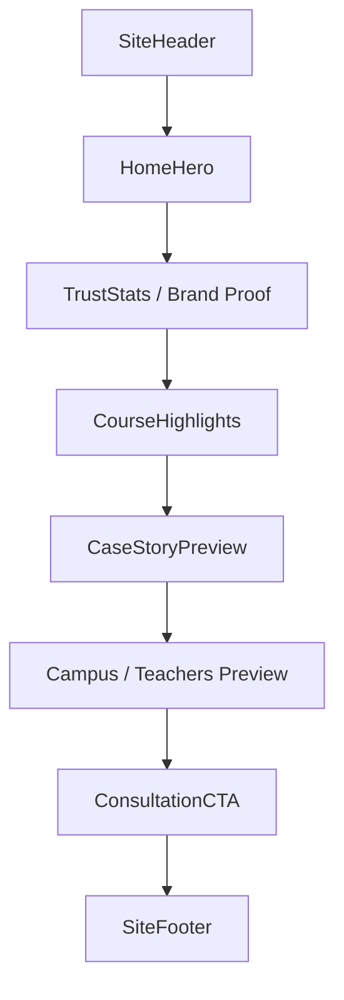
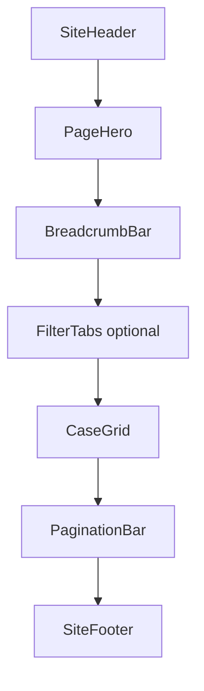
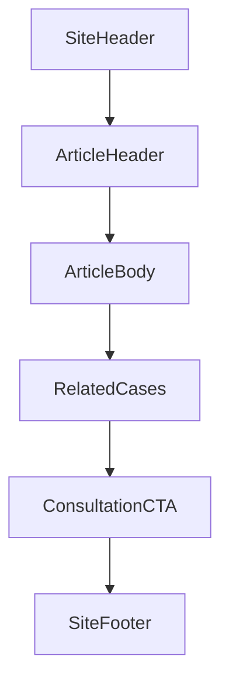

# 网站设计调研：行动教育风格 × shadcn/ui 组件选型

更新时间：2026-06-11  
目标：在不盲目造轮子的前提下，把 `docs/行动教育 Design.md` 的设计风格转成可实现的网站组件策略。

## 结论

本项目可以优先采用 shadcn/ui 作为基础交互组件层，再用项目自己的业务组件承载“行动教育”官网气质。

推荐策略不是照搬行动教育官网，也不是直接套 shadcn 默认风格，而是：



可以直接使用 shadcn/ui 的组件负责可访问性、状态、键盘交互和基础样式；需要封装的是官网里的 `SiteHeader`、`HeroBanner`、`CaseCard`、`SiteFooter` 等业务结构；只有品牌资产、hero 渐变、二维码咨询区、备案/地址页脚这类官网特定模块需要自定义。

## 输入依据

| 来源 | 用途 | 结论 |
|---|---|---|
| `docs/行动教育 Design.md` | 项目设计风格与 tokens | 主色 `#104198`，字体偏系统中文栈，风格要求清晰、功能、实现导向 |
| `行动教育官网案例页研究` | 页面结构与风险 | 结构可参考：Header、Hero、Breadcrumb、Card Grid、Pagination、Footer；移动端不应照搬 |
| `https://ui.shadcn.com/docs/components` | 官方组件目录 | 可用组件覆盖导航、卡片、按钮、分页、表单、弹层等基础需求 |
| `https://ui.shadcn.com/docs/skills` | 官方 skill 说明 | shadcn 有官方 Skills 概念，但需要项目内有 `components.json` 才能做项目感知 |
| `https://ui.shadcn.com/docs/mcp` | 官方 MCP 说明 | shadcn MCP 可浏览、搜索、安装 registry 组件；当前环境未暴露该 MCP |
| `npx shadcn@latest docs ...` | 本地 CLI 验证 | CLI 可查组件文档；本仓库尚无前端工程与 `components.json` |

## 当前约束

- 仓库目前没有 `package.json`、`components.json`、`src/`、`app/` 等前端工程骨架。
- 因此本阶段只做设计调研和组件选型，不执行 `shadcn init` 或安装组件。
- 当前 `docs/行动教育 Design.md` 里写的是 `documentation site`，但用户目标更接近“官方展示网站”。后续 PRD 或实现前应修正这个产品表面定义。

## 风格提炼

行动教育官网给人的核心信号是“稳重、可信、企业教育、上市公司、真实案例”。视觉上不靠复杂动效，而靠真实摄影、蓝白品牌色、清晰栏目和整齐网格建立信任。

| 维度 | 设计规则 |
|---|---|
| 色彩 | 必须以品牌蓝 `#104198` 为主行动色；白底为主；深色页脚可使用接近 `#373f4f` 的企业深灰蓝 |
| 字体 | 应优先使用 `SF Pro SC / PingFang SC / Microsoft YaHei / Helvetica Neue / Arial` 中文系统栈 |
| 圆角 | 应克制，卡片和按钮默认 4-6px；不要做过度圆润的 SaaS 风 |
| 图片 | 必须使用真实场景图、人物图或课程现场图；不要用抽象渐变图替代关键信任资产 |
| 信息密度 | 桌面端可以三列卡片；移动端必须单列或舒适双列，不能复刻原站挤压问题 |
| 交互 | 下拉导航、分页、咨询 CTA、移动抽屉菜单必须键盘可达且有 focus-visible |

## shadcn/ui 可直接使用的组件

这些组件不建议自造，直接用 shadcn/ui，再通过 tokens 覆盖品牌风格。

| 官网需求 | shadcn 组件 | 用法建议 |
|---|---|---|
| 主按钮、咨询按钮、分页按钮 | `Button` | 定义 `primaryBlue` variant，绑定品牌蓝和 focus ring |
| 顶部导航下拉 | `Navigation Menu` 或 `Dropdown Menu` | 桌面导航用 `Navigation Menu`；简单菜单或更多操作用 `Dropdown Menu` |
| 移动端菜单 | `Sheet` | 左侧或右侧抽屉菜单；必须有关闭按钮、ESC 关闭、焦点回收 |
| 面包屑 | `Breadcrumb` | 用于栏目页和详情页；移动端可压缩中间层级 |
| 内容卡片 | `Card` | 作为基础外壳；图片比例和标题截断在业务层控制 |
| 图片比例 | `Aspect Ratio` | 案例卡统一 `4:3` 或 `16:10`，hero 另行封装 |
| 状态标签 | `Badge` | 用于“上市公司”“热门课程”“校友故事”等轻标签 |
| 分页 | `Pagination` | 桌面完整页码，移动端保留上一页/下一页或精简页码 |
| 分隔线 | `Separator` | 用于 footer 分组、内容区块轻分隔 |
| 骨架加载 | `Skeleton` | 列表页、图片卡片、详情页加载态必须有 |
| FAQ / 课程问答 | `Accordion` | 课程咨询、常见问题、校区说明 |
| 首页轮播或校友故事精选 | `Carousel` | 只用于真正需要横向浏览的内容；不要替代普通列表 |
| 表单字段 | `Field`、`Input`、`Textarea` | 课程咨询表单；必须补错误态、帮助文本、必填说明 |
| 弹层确认 | `Dialog` / `Alert Dialog` | 预约确认、提交成功、失败提示 |
| 提示 | `Tooltip` | 只用于图标按钮或不明显控件，不用于解释正文内容 |

## 需要业务封装的组件

这些不是从零造轮子，而是在 shadcn 基础组件上封装成项目语义组件。

| 业务组件 | 基础组件 | 责任边界 |
|---|---|---|
| `SiteHeader` | `Navigation Menu`、`Button`、`Sheet`、`Badge` | Logo、上市公司标签、桌面导航、移动菜单、咨询入口 |
| `PageHero` | 自定义容器 + `Aspect Ratio` 思路 | 大图、暗渐变、中文标题、英文副标题、响应式安全区 |
| `BreadcrumbBar` | `Breadcrumb` | 统一栏目路径、当前页样式、移动端折叠规则 |
| `CaseCard` | `Card`、`Aspect Ratio`、`Badge` | 图片、标题、摘要、日期、hover/focus 状态、长文本截断 |
| `CaseGrid` | CSS Grid + `CaseCard` | 桌面三列、平板两列、手机单列、空状态、加载态 |
| `PaginationBar` | `Pagination` | 页码密度、移动端简化、aria label |
| `ConsultationCTA` | `Button`、`Dialog`、表单组件 | 课程咨询入口、二维码、表单或外链策略 |
| `SiteFooter` | `Separator` + 自定义布局 | 栏目链接、二维码、地址、备案、友情链接 |
| `SectionHeader` | `Typography` 规则 + 自定义布局 | 中文标题、英文副标题、轻说明 |

## 真正需要自造的部分

| 模块 | 为什么不能只用 shadcn | 实现建议 |
|---|---|---|
| 品牌 Logo 组合 | shadcn 不提供品牌资产 | 用项目静态资源，定义固定尺寸、留白和移动端缩放规则 |
| Hero 图片遮罩 | 与品牌图片、安全区、标题位置强相关 | 自定义 `PageHero`，使用 CSS gradient overlay，避免文字压到主体人物 |
| 二维码咨询区 | 国内官网常见，但不是通用组件 | 封装 `QrConsultBlock`，支持图片、说明、备用联系电话或表单入口 |
| ICP / 地址页脚 | 地域和合规信息固定 | 自定义 `LegalFooter`，移动端保持可读行高 |
| 案例内容模型 | 业务字段决定卡片信息 | 定义 `CaseItem` 数据结构，而不是把字段散落到 JSX |

## 页面模板建议

### 首页



建议组件来源：

- `SiteHeader`：封装 `Navigation Menu` + `Sheet`
- `HomeHero`：自定义
- `TrustStats`：`Card` + `Badge`
- `CourseHighlights`：`Card` + `Button`
- `CaseStoryPreview`：`CaseGrid`
- `ConsultationCTA`：`Button` + `Dialog` 或二维码块

### 栏目列表页



这个模板最接近行动教育 `校友故事` 页面。重点是保持桌面三列的秩序感，同时修复移动端：手机必须单列，图片比例稳定，标题最多 2 行，摘要可选隐藏。

### 详情页



建议优先自定义 `ArticleBody` 的排版，不要把所有内容塞进 `Card`。

## Token 到 shadcn 的映射

| 项目 token | shadcn / CSS 变量建议 | 注意 |
|---|---|---|
| `color.surface.strong=#104198` | `--primary` / `--ring` / 自定义 `--brand-blue` | 当前 shadcn 新版常用 OKLCH；实现时要转成项目统一格式 |
| `color.text.secondary=#606266` | `--muted-foreground` | 必须检查对比度，避免浅灰正文 |
| `color.surface.raised=#f5f7fa` | `--muted` / `--accent` | 适合浅背景和 hover |
| `radius.xs=2px`, `radius.sm=5px` | `--radius` | 建议 `--radius: 0.3rem` 左右，避免过圆 |
| `shadow.1` | card shadow utility | 官网卡片阴影应轻，不要做重阴影 |
| `motion.duration.instant=300ms` | transition duration | 菜单、抽屉、hover 可用 200-300ms |

## 响应式规则

| 断点 | 布局 |
|---|---|
| `< 640px` | 单列内容；Header 使用 `Sheet`；分页精简；footer 单列或两列 |
| `640-1024px` | 两列卡片；导航可视内容减少；CTA 保持可触达 |
| `> 1024px` | 三列卡片；完整导航；footer 多列 |

禁止复刻行动教育原站的移动端挤压行为。移动端必须通过截图或浏览器验证：无横向滚动、文字不被裁切、卡片不变成窄条。

## 组件优先级

第一批应安装或实现：

1. `button`
2. `card`
3. `navigation-menu`
4. `sheet`
5. `breadcrumb`
6. `pagination`
7. `aspect-ratio`
8. `badge`
9. `separator`
10. `skeleton`

第二批按页面需要补：

1. `accordion`
2. `dialog`
3. `field`
4. `input`
5. `textarea`
6. `tooltip`
7. `carousel`

## 实施建议

在建立前端工程后，再执行 shadcn 初始化。推荐流程：

```bash
npx shadcn@latest init
npx shadcn@latest add button card navigation-menu sheet breadcrumb pagination aspect-ratio badge separator skeleton
```

如果要启用官方 shadcn skill / MCP：

1. 先确保项目有 `components.json`。
2. 再按 shadcn 官方 MCP 文档配置 Codex。
3. 重启 Codex 后确认 shadcn MCP 工具是否暴露。
4. 再用 registry 搜索和安装组件。

当前阶段不要为了“能用 shadcn”提前创建半成品工程；先把信息架构、页面模板和组件边界定清楚。

## QA 清单

- [ ] 所有交互组件都有 default、hover、focus-visible、active、disabled、loading、error 状态。
- [ ] Header 可键盘导航，移动菜单可 ESC 关闭并回收焦点。
- [ ] 卡片图片使用稳定比例，不因图片尺寸不同导致跳动。
- [ ] 列表页移动端无横向滚动。
- [ ] 品牌蓝按钮和正文灰色文本满足 WCAG 2.2 AA 对比度。
- [ ] 分页有明确 `aria-label`，当前页有可读状态。
- [ ] 咨询表单错误信息与字段关联。
- [ ] Footer 中二维码、地址、备案信息在手机端可读。
- [ ] 页面不依赖 hover 才能获得关键信息。
- [ ] Lighthouse 检查不低于：Performance 80、Accessibility 90、SEO 90。

## 参考链接

- shadcn/ui components: https://ui.shadcn.com/docs/components
- shadcn/ui skills: https://ui.shadcn.com/docs/skills
- shadcn/ui MCP: https://ui.shadcn.com/docs/mcp
- shadcn/ui registry: https://ui.shadcn.com/docs/registry
- shadcn/ui blocks: https://ui.shadcn.com/blocks
